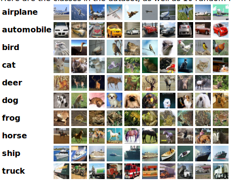

# ATTENTION MODEL ON MOSAIC IMAGE 

### CIFAR 10 Dataset

### Generationtion of data i.e Mosaic Images

  - CIFAR 10, Every image is 32x32 pixel
  - Every Mosaic image is a collection of 9 images i.e 96x96 pixel viz a grid of 3x3 images.
  - 10 classes are divided into 7 background classes and 3 foreground classes.
  - In 3x3 image grid,  8 images sampled from 7 background classes and 1 image is sampled from foreground classes randomly.
  - The class of the Mosaic Image will be same as that of class of the Foreground image present in the Mosaic image.

### Visualise Mosaic Data
- Available Classes = ('plane', 'car', 'bird', 'cat', 'deer', 'dog', 'frog', 'horse', 'ship', 'truck')
- foreground_classes = {'horse','ship', 'truck'}
- background_classes = {'plane', 'car', 'bird', 'cat', 'deer', 'dog', 'frog'}
- ##### Foreground classes : 

- ##### Background classes : 

- ##### Sample Mosaic Image : 

- ##### Image wise input from Mosaic Image to where Network : 
 
- ##### Sample Input for Where Network : 

- ##### Aggregated weights for every image by Where Network : 
[0.0108, 0.1477, 0.0153, 0.1082, 0.0713, 0.4948, 0.0430, 0.0225, 0.0865] 
Clearly Where Network is focusing on first image ("Ship") by 0.4948 probability.
- ##### True foreground Image in Mosaic : 

- ##### Aggregated Image output by Where Network : 

- ##### Class Predicted by What Network : "Ship"
- ##### True Class : "Ship"

### MODEL
  - Model is developed as combination of 2 modules.
  - Module 1 learns "WHERE" the foreground image is present out of 9 images in Mosaic image.
  - Module 2 learns "WHAT" is the class of this foreground image out of those 3 foreground classes.

### Input to Model
  - Module 1 is inside module 2.
  - Mosaic image is input to Module 2. which passes it as a input to module 1.
  - Output of Module 1 is then input to Module 2.
  - Module 2 predicts the final class label of the Mosaic Image.

### Weights link Gdrive
> https://drive.google.com/open?id=1LaROa-zV1RFeaKC5EzDhSaBiTnXU1g4l

### Plots for Focus vs Predicted on Training Data 
  

### Plots for Focus vs Predicted on Testing Data 
  
