# STAGE WISE TRAINING OF ATTENTION MODEL ON MOSAIC IMAGE 

### CIFAR 10 Dataset

### Generationtion of data i.e Mosaic Images

  - CIFAR 10, Every image is 32x32 pixel
  - Every Mosaic image is a collection of 9 images i.e 96x96 pixel viz a grid of 3x3 images.
  - 10 classes are divided into 7 background classes and 3 foreground classes.
  - In 3x3 image grid,  8 images sampled from 7 background classes and 1 image is sampled from foreground classes randomly.
  - The class of the Mosaic Image will be same as that of class of the Foreground image present in the Mosaic image.

### Visualise Mosaic Data
- Available Classes = ('plane', 'car', 'bird', 'cat', 'deer', 'dog', 'frog', 'horse', 'ship', 'truck')
- foreground_classes = {'horse','ship', 'truck'}
- background_classes = {'plane', 'car', 'bird', 'cat', 'deer', 'dog', 'frog'}
- ##### Foreground classes : 

- ##### Background classes : 

- ##### Sample Mosaic Image : 

- ##### Image wise input from Mosaic Image to where Network : 
 
- ##### Sample Input for Where Network : 

- ##### Aggregated weights for every image by Where Network : 
        [0.0108, 0.1477, 0.0153, 0.1082, 0.0713, 0.4948, 0.0430, 0.0225, 0.0865] 
        Clearly Where Network is focusing on first image ("Ship") by 0.4948 probability.
- ##### Aggregated Image output by Where Network : 

- ##### True foreground Image in Mosaic : 


- ##### Class Predicted by What Network : "Ship"
- ##### True Class : "Ship"

### MODEL
  - Model is developed as combination of 2 modules.
  - Module 1 learns "WHERE" the foreground image is present out of 9 images in Mosaic image.
  - Module 2 learns "WHAT" is the class of this foreground image out of those 3 foreground classes.

### Input to Model
  - Mosaic image is input to Module 1 i.e "Where Network", and tries to focus on foregorund image present in Mosaic Image.
  - Output of Module 1 is weighted average of images present in Mosaic and this is then input to Module 2.
  - Module 2 i.e "What Network" predicts the final class label of the Mosaic Image.

### Architecture of the Model
```python
import torch.nn as nn
import torch.nn.functional as F

class Module1(nn.Module):
  def __init__(self):
    super(Module1, self).__init__()
    self.conv1 = nn.Conv2d(3, 6, 5)
    self.pool = nn.MaxPool2d(2, 2)
    self.conv2 = nn.Conv2d(6, 16, 5)
    self.fc1 = nn.Linear(16 * 5 * 5, 120)
    self.fc2 = nn.Linear(120, 84)
    self.fc3 = nn.Linear(84, 10)
    self.fc4 = nn.Linear(10,1)

  def forward(self, z):
    x = torch.zeros([batch,9],dtype=torch.float64)
    y = torch.zeros([batch,3, 32,32], dtype=torch.float64)
    x,y = x.to("cuda"),y.to("cuda")
    for i in range(9):
      x[:,i] = self.helper(z[:,i])[:,0]
    x = F.softmax(x,dim=1)   # alphas
    x1 = x[:,0]
    torch.mul(x1[:,None,None,None],z[:,0])
    for i in range(9):            
      x1 = x[:,i]          
      y = y + torch.mul(x1[:,None,None,None],z[:,i])
    return y , x 
  
  def helper(self,x):
    x = self.pool(F.relu(self.conv1(x)))
    x = self.pool(F.relu(self.conv2(x)))
    x = x.view(-1, 16 * 5 * 5)
    x = F.relu(self.fc1(x))
    x = F.relu(self.fc2(x))
    x = F.relu(self.fc3(x))
    x = self.fc4(x)
    return x

class Module2(nn.Module):
  def __init__(self):
    super(Module2, self).__init__()
    self.conv1 = nn.Conv2d(3, 6, 5)
    self.pool = nn.MaxPool2d(2, 2)
    self.conv2 = nn.Conv2d(6, 16, 5)
    self.fc1 = nn.Linear(16 * 5 * 5, 120)
    self.fc2 = nn.Linear(120, 84)
    self.fc3 = nn.Linear(84, 10)
    self.fc4 = nn.Linear(10,3)

  def forward(self,y):  #z batch of list of 9 images
    y1 = self.pool(F.relu(self.conv1(y)))
    y1 = self.pool(F.relu(self.conv2(y1)))
    y1 = y1.view(-1, 16 * 5 * 5)
    y1 = F.relu(self.fc1(y1))
    y1 = F.relu(self.fc2(y1))
    y1 = F.relu(self.fc3(y1))
    y1 = self.fc4(y1)
    return y1 

where_net = Module1().double()
what_net = Module2().double()
```
### How the Model was Trained :
- First What then Where:

        We trained the model in stage wise fashion, i.e we trained the "What Network" first for "k" Epochs and then "Where Network" for "k" Epochs. We continued training for "n*(2k)" Total Epochs, where "n" and "k" are Positive integers.  
- First Where Then What:

        We trained the model in stage wise fashion, i.e we trained the "Where Network" first for "k" Epochs and then "What Network" for "k" Epochs. We continued training for "n*(2k)" Total Epochs, where "n" and "k" are Positive integers.
- Learning rates were kept different for both the network in all the expirements in both variations.

### Table 1: First "What Network" then "Where Network"
| Experiment No. | Total Epochs | Train Network for Epoch | "What" Learning Rate | "Where" Learning Rate | Training Accuracy  | Testing Accuracy |
|----------------|--------------|-------------------------|--------------------|---------------------|--------------------|------------------|
| 1              | 180          | 5                       | 0.01               | 0.01                | 0.96               | 0.81             |
| 2              | 200          | 10                      | 0.01               | 0.01                | 0.94               | 0.79             |
| 3              | 280          | 20                      | 0.01               | 0.001               | 0.97               | 0.43             |
| 4              | 320          | 20                      | 0.01               | 0.01                | 0.97               | 0.79             |
| 5              | 360          | 30                      | 0.01               | 0.01                | 0.99               | 0.76             |
| 6              | 500          | 50                      | 0.01               | 0.01                | 0.86               | 0.41             |
| 7              | 600          | 50                      | 0.001              | 0.01                | 0.97               | 0.82             |
| 8              | 800          | 100                     | 0.001              | 0.01                | 0.97               | 0.83             |

### Weights and CSV (containing focus_vs_pred values every 5 epoch) of above experiments can be found at following Gdrive link :
> First "What Network" then "Where Network": https://drive.google.com/open?id=1WjUpNuVs8Jy2aCFtnyiWVzJDPopplX_i

### PLOTS For Experiments of First "What Network" then "Where Network"
#### Experiment 1: Total Epochs: 180, Train Every: 5, What lr: 0.01, Where lr: 0.01, train acc: 0.96, test acc: 0.81
  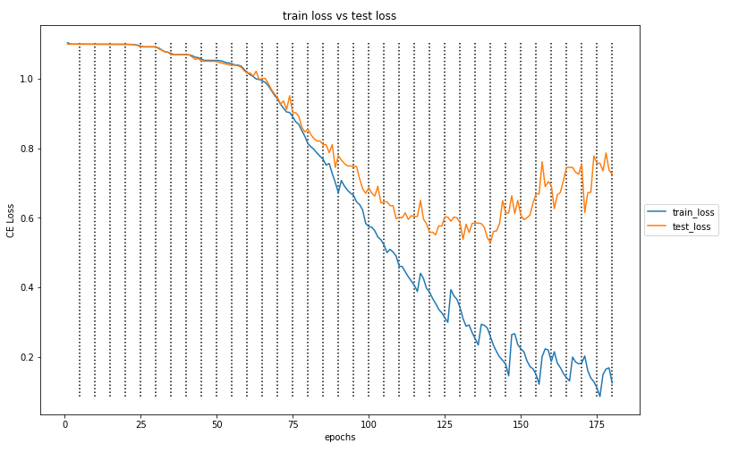
  
  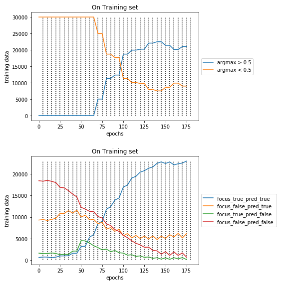
  
#### Experiment 2: Total Epochs: 200, Train Every: 10, What lr: 0.01, Where lr: 0.01, train acc: 0.94, test acc: 0.79
  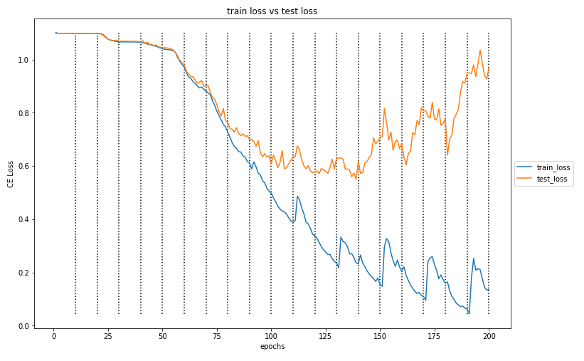
  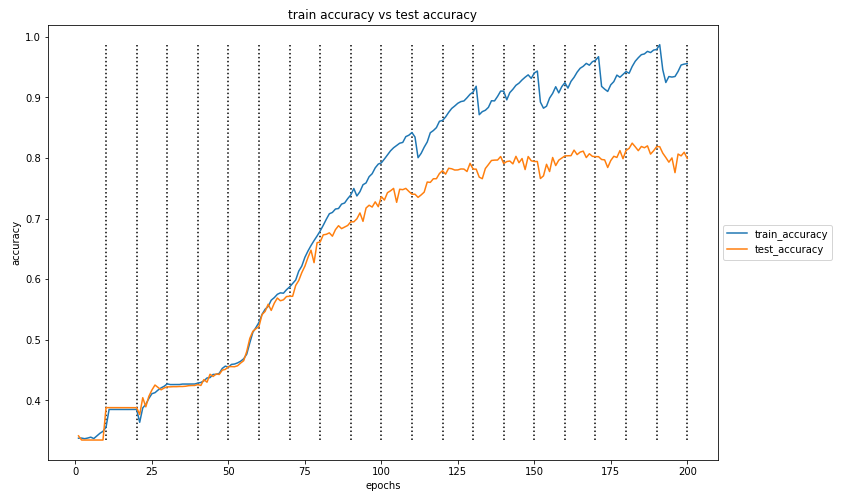
  
  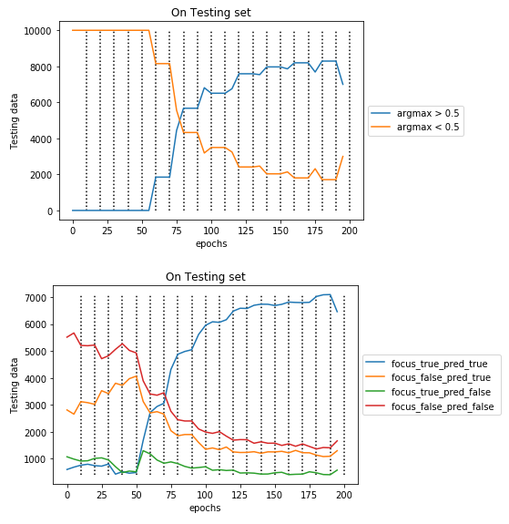
#### Experiment 3: Total Epochs: 280, Train Every: 20, What lr: 0.01, Where lr: 0.001, train acc: 0.97, test acc: 0.43
  
  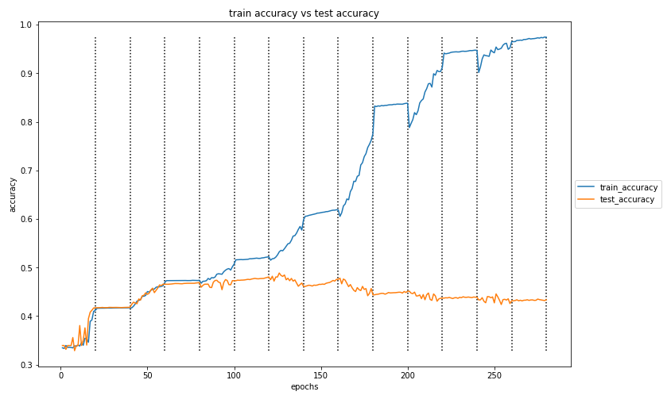
  
  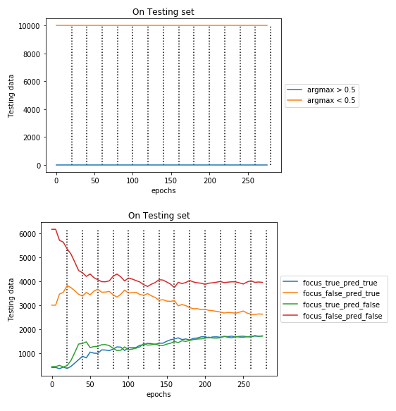
#### Experiment 4: Total Epochs: 320, Train Every: 20, What lr: 0.01, Where lr: 0.01, train acc: 0.97, test acc: 0.79
  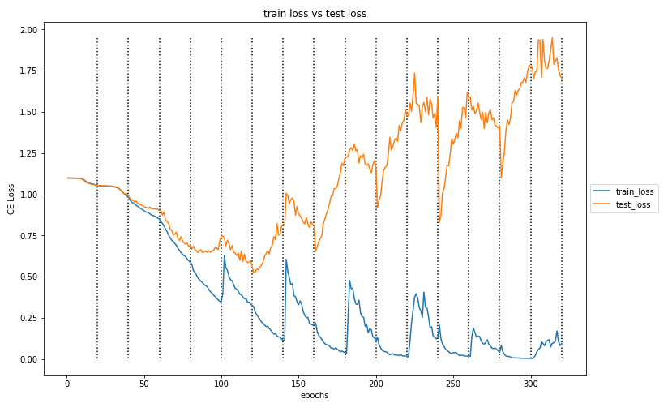
  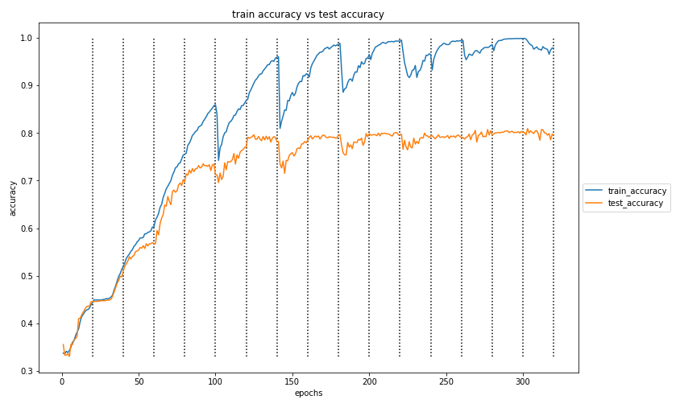
  
  
#### Experiment 5: Total Epochs: 360, Train Every: 30, What lr: 0.01, Where lr: 0.01, train acc: 0.99, test acc: 0.76
  
  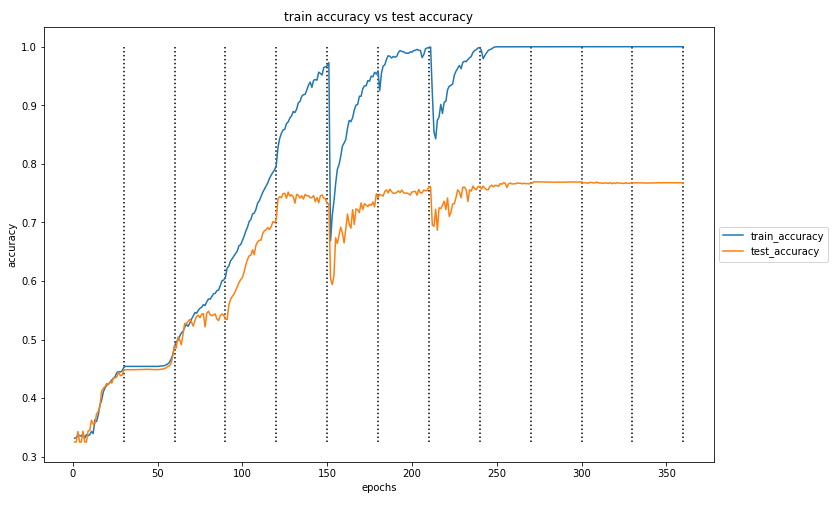
  
  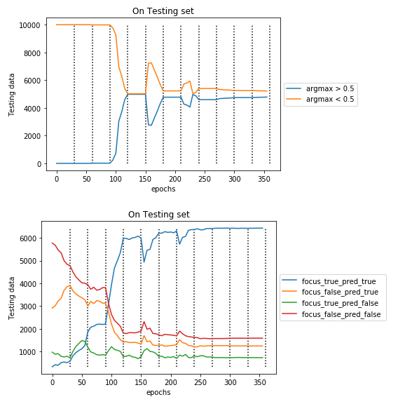
#### Experiment 6: Total Epochs: 500, Train Every: 50, What lr: 0.01, Where lr: 0.01, train acc: 0.86, test acc: 0.41
  
  
  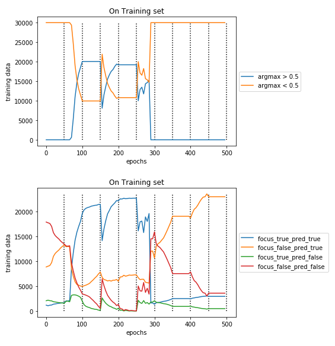
  
#### Experiment 7: Total Epochs: 500, Train Every: 50, What lr: 0.001, Where lr: 0.01, train acc: 0.97, test acc: 0.82
  
  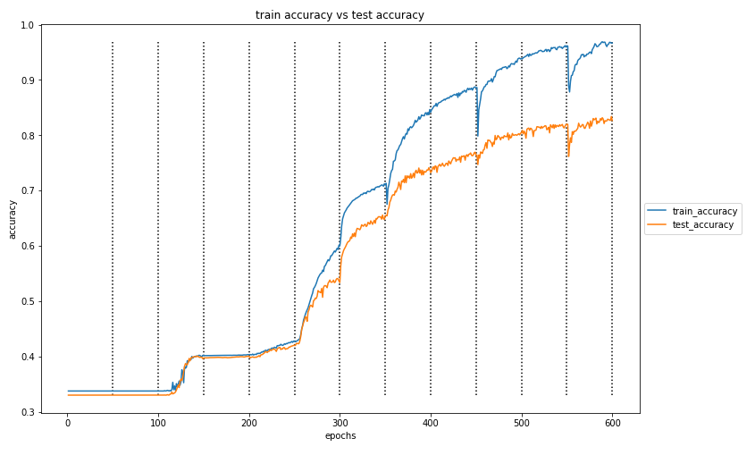
  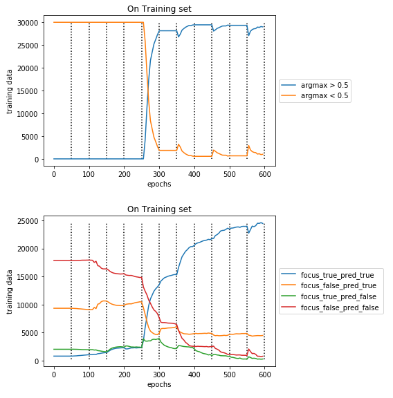
  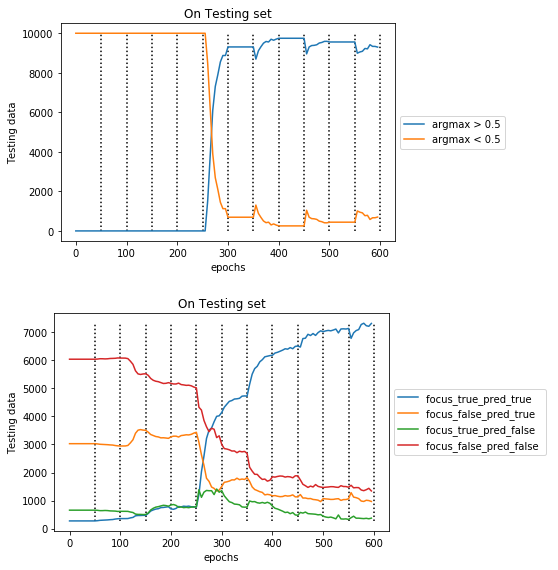
#### Experiment 8: Total Epochs: 800, Train Every: 100, What lr: 0.001, Where lr: 0.01, train acc: 0.97, test acc: 0.83
  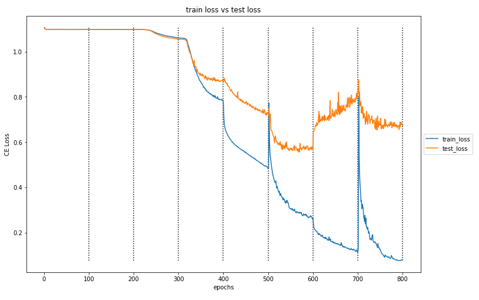
  
  
  
