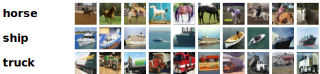
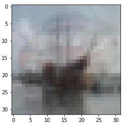
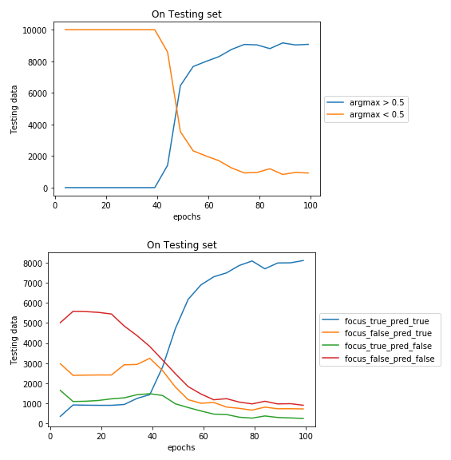
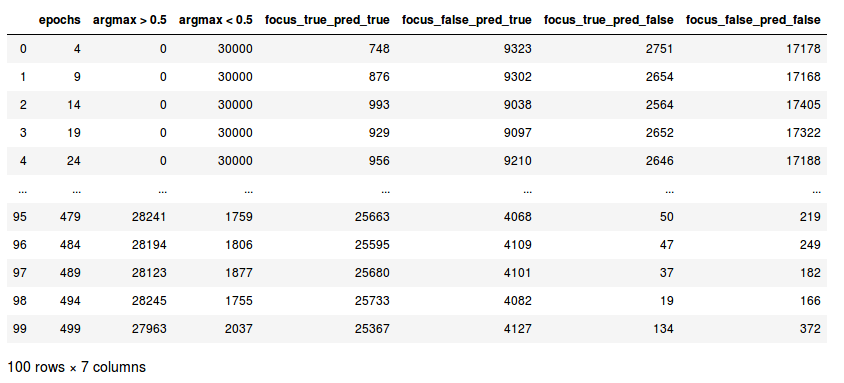
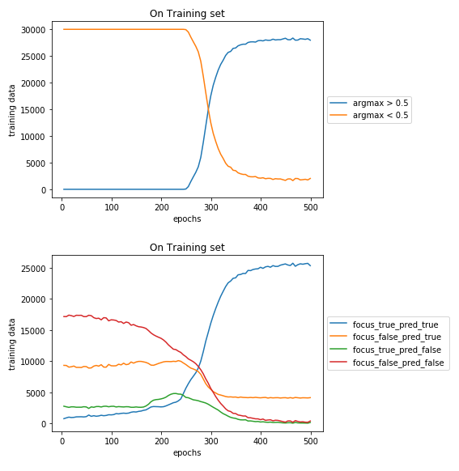

# AVERAGING AT CONVOLUTION LAYER OF ATTENTION MODEL ON MOSAIC IMAGE 

### CIFAR 10 Dataset

### Generationtion of data i.e Mosaic Images

  - CIFAR 10, Every image is 32x32 pixel
  - Every Mosaic image is a collection of 9 images i.e 96x96 pixel viz a grid of 3x3 images.
  - 10 classes are divided into 7 background classes and 3 foreground classes.
  - In 3x3 image grid,  8 images sampled from 7 background classes and 1 image is sampled from foreground classes randomly.
  - The class of the Mosaic Image will be same as that of class of the Foreground image present in the Mosaic image.

### Visualise Mosaic Data
- Available Classes = ('plane', 'car', 'bird', 'cat', 'deer', 'dog', 'frog', 'horse', 'ship', 'truck')
- foreground_classes = {'horse','ship', 'truck'}
- background_classes = {'plane', 'car', 'bird', 'cat', 'deer', 'dog', 'frog'}
- ##### Foreground classes : 

- ##### Background classes : 

- ##### Sample Mosaic Image : 

- ##### Image wise input from Mosaic Image to where Network : 
 
- ##### Sample Input for Where Network : 

- ##### Aggregated weights for every image by Where Network : 
        [0.0108, 0.1477, 0.0153, 0.1082, 0.0713, 0.4948, 0.0430, 0.0225, 0.0865] 
        Clearly Where Network is focusing on first image ("Ship") by 0.4948 probability.
- ##### Aggregated Image output by Where Network : 

- ##### True foreground Image in Mosaic : 


- ##### Class Predicted by What Network : "Ship"
- ##### True Class : "Ship"

### MODEL
  - Model is developed as combination of 2 modules.
  - Module 1 learns "WHERE" the foreground image is present out of 9 images in Mosaic image.
  - Module 2 learns "WHAT" is the class of this foreground image out of those 3 foreground classes.

### Input to Model
  - Module 1 is inside module 2.
  - Mosaic image is input to Module 2. which passes it as a input to module 1.
  - Output of Module 1 is then input to Module 2.
  - Module 2 predicts the final class label of the Mosaic Image.

### Architecture of the Model
```python
class Module1(nn.Module):
    def __init__(self):
        super(Module1, self).__init__()
        self.conv1 = nn.Conv2d(3, 6, 5)
        self.pool = nn.MaxPool2d(2, 2)
        self.conv2 = nn.Conv2d(6, 16, 5)
        self.fc1 = nn.Linear(16 * 12 * 12, 120)
        self.fc2 = nn.Linear(120, 84)
        self.fc3 = nn.Linear(84, 10)
        self.fc4 = nn.Linear(10,1)

    def forward(self, x):
        x1 = F.relu(self.conv1(x))
        x = self.pool(x1)
        x = self.pool(F.relu(self.conv2(x1)))
        x = x.view(-1, 16 * 12* 12)
        x = F.relu(self.fc1(x))
        x = F.relu(self.fc2(x))
        x = F.relu(self.fc3(x))
        x = self.fc4(x)
        return x,x1

class Module2(nn.Module):
    def __init__(self):
        super(Module2, self).__init__()
        self.module1 = Module1().double()
        self.module1 = self.module1.to(device)
        self.conv1 = nn.Conv2d(6, 6, 5)
        self.pool = nn.MaxPool2d(2, 2)
        self.conv2 = nn.Conv2d(6, 16, 5)
        self.fc1 = nn.Linear(16 * 4* 4,120)
        self.fc2 = nn.Linear(120, 84)
        self.fc3 = nn.Linear(84, 10)
        self.fc4 = nn.Linear(10,3)
        
        
    def forward(self,z):  #z batch of list of 9 images
        y = torch.zeros([batch,6, 28,28], dtype=torch.float64)
        x = torch.zeros([batch,9],dtype=torch.float64)
        x1 = torch.zeros([batch,9,6,28,28],dtype=torch.float64)
        y  = y.to(device)
        x1,x = x1.to(device),x.to(device)
        for i in range(9):
            k,l  =  self.module1.forward(z[:,i,:,:,:])
            x[:,i] = k[:,0]
            x1[:,i,:,:,:] = l
        x = F.softmax(x,dim=1)
        for i in range(9):
            x2 = x[:,i]          
            y = y + torch.mul(x2[:,None,None,None],x1[:,i])
        y1 = self.pool(F.relu(self.conv1(y)))
        y1 = self.pool(F.relu(self.conv2(y1)))
        y1 = y1.view(-1, 16 * 4* 4)
        y1 = F.relu(self.fc1(y1))
        y1 = F.relu(self.fc2(y1))
        y1 = F.relu(self.fc3(y1))
        y1 = self.fc4(y1)
        return y1 , x, y
fore_net = Module2().double()
fore_net = fore_net.to(device)
```
### How the Model was Trained :
- Every image of Mosaic is Input to Module 1 ("Where Network", viz is inside Module 2) and average is taken after first layer of Convolution layer.
- This average image is passed to "What Network" to predict the foreground class.


### Table 1: Analysis of Model on different Parameters
| Experiment No. | Total Epochs | Learning Rate | Training Accuracy  | Testing Accuracy |
|----------------|--------------|---------------|--------------------|------------------|
| 1              | 100          | 0.01          | 0.983              | 0.88             |
| 2              | 500         |  0.001         | 0.98               | 0.85             |

### Weights and CSV (containing focus_vs_pred values every 5 epoch) of above experiments can be found at following Gdrive link :
> First "What Network" then "Where Network": https://drive.google.com/open?id=1hYmawLgYG47dA9jLHkiSynOm9UAQRtz3

### PLOTS For Experiments are as below:

#### Experiment 1: Total Epochs: 100, learning rate: 0.01, train acc: 0.98, test acc: 0.88
  
  
  
  
#### Experiment 2: Total Epochs: 500, learning rate: 0.001, train acc: 0.98, test acc: 0.85
  
  
  
  

