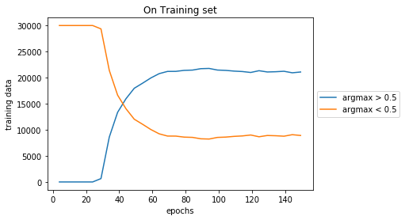
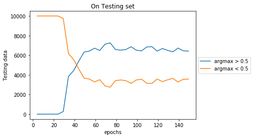

### Testing What_net by making data forcibly true during training

  - to check how what network is behaving on true CIFAR10 data during training

### Generation of data i.e Mosaic Images

  - CIFAR 10, Every image is 32x32 pixel
  - Every Mosaic image is a collection of 9 images i.e 96x96 pixel viz a grid of 3x3 images.
  - 10 classes are divided into 7 background classes and 3 foreground classes.
  - In 3x3 image grid,  8 images sampled from 7 background classes and 1 image is sampled from foreground classes randomly.
  - The class of the Mosaic Image will be same as that of class of the Foreground image present in the Mosaic image.

### Visualise Mosaic Data
- Available Classes = ('plane', 'car', 'bird', 'cat', 'deer', 'dog', 'frog', 'horse', 'ship', 'truck')
- foreground_classes = {'horse','ship', 'truck'}
- background_classes = {'plane', 'car', 'bird', 'cat', 'deer', 'dog', 'frog'}

### MODEL
  - Model is developed as combination of 2 modules.
  - Module 1 learns "WHERE" the foreground image is present out of 9 images in Mosaic image.
  - Module 2 learns "WHAT" is the class of this foreground image out of those 3 foreground classes.

### Input to Model
  - Module 1 is inside module 2.
  - Mosaic image is input to Module 2. which passes it as a input to module 1.
  - Output of Module 1 is then input to Module 2.
  - Module 2 predicts the final class label of the Mosaic Image.
  
  ### PLOTS For Experiments are as below:
  
  
  
  
  ### Observations
   - accuracy increases Consistently (using only classification net) on true train data (original CIFAR10) as well as test data(original CIFAR10 Test data). We took only 3 classes from CIFAR10 i.e 0,1,2 classes.
