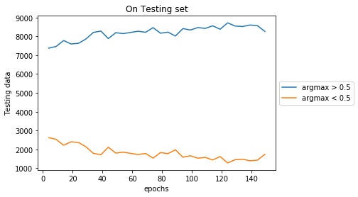

### Training mosaic data on pretrained models
### Generation of data i.e Mosaic Images

  - CIFAR 10, Every image is 32x32 pixel
  - Every Mosaic image is a collection of 9 images i.e 96x96 pixel viz a grid of 3x3 images.
  - 10 classes are divided into 7 background classes and 3 foreground classes.
  - In 3x3 image grid,  8 images sampled from 7 background classes and 1 image is sampled from foreground classes randomly.
  - The class of the Mosaic Image will be same as that of class of the Foreground image present in the Mosaic image.

### Visualise Mosaic Data
- Available Classes = ('plane', 'car', 'bird', 'cat', 'deer', 'dog', 'frog', 'horse', 'ship', 'truck')
- foreground_classes = {'horse','ship', 'truck'}
- background_classes = {'plane', 'car', 'bird', 'cat', 'deer', 'dog', 'frog'}

### Model
  - Model is developed as combination of 2 modules.
  - Module 1 learns "WHERE" the foreground image is present out of 9 images in Mosaic image.
  - Module 2 learns "WHAT" is the class of this foreground image out of those 3 foreground classes.
  - A model is pretrained on CIFAR10 dataset, this pretrained model is then used for both  "WHERE" net and "WHAT" net with pretrained weights.
  
  ### Input to Model
  - For pretraining first a model is trained on CIFAR10 dataset.
  - Module 1 is inside module 2.
  - Mosaic image is input to Module 2. which passes it as a input to module 1.
  - Output of Module 1 is then input to Module 2.
  - Module 2 predicts the final class label of the Mosaic Image.
  
  ### Experiments
  - Model 1
    - learning rate  0.01
    - Pretrained model
        - CNN(6) -> MaxPool -> CONV(16) -> MaxPool -> Flatten -> fc1(120) -> fc2(10)
    - What Network
        - CNN(6) -> MaxPool -> CONV(16) -> MaxPool -> Flatten -> fc1(120) -> fc2(3)
    - Where Network 
        - CNN(6) -> MaxPool -> CONV(16) -> MaxPool -> Flatten -> fc1(120) -> fc2(1)
  - Model 1
    - learning rate  0.001
    - Pretrained model
        - CNN(6) -> MaxPool -> CONV(16) -> MaxPool -> Flatten -> fc1(120) -> fc2(10)
    - What Network
        - CNN(6) -> MaxPool -> CONV(16) -> MaxPool -> Flatten -> fc1(120) -> fc2(3)
    - Where Network 
        - CNN(6) -> MaxPool -> CONV(16) -> MaxPool -> Flatten -> fc1(120) -> fc2(1)
   
 - Model 2 
    - learning rate  0.01
    - Pretrained model
       - CNN(16) -> MaxPool -> CONV(32) -> MaxPool -> Flatten -> fc1(64) -> fc2(10)
    - What Network
        - CNN(16) -> MaxPool -> CONV(32) -> MaxPool -> Flatten -> fc1(64) -> fc2(3)
    - Where Network 
        - CNN(16) -> MaxPool -> CONV(32) -> MaxPool -> Flatten -> fc1(64) -> fc2(1)
        
# Learning rate for all pretrained models are 0.01
### Results
 - Model 1 -lr1
     - number of epochs for pretrained model  =  100
     - pretrained model accurracy = 0.587
     - focibly_true_accuracy:  13460
     - mosaic_data_training_accuracy : 0.8834
     - mosaic_data_test_accuracy : 0.7837
     
     ### PLOTS For Experiments are as below:
      
      
    
 - Model 1 - lr2
     - number of epochs for pretrained model  =  100
     - pretrained model accurracy = 0.584
     - focibly_true_accuracy:  13128
     - mosaic_data_training_accuracy : 0.8559
     - mosaic_data_test_accuracy : 0.7475
     
     ### PLOTS For Experiments are as below:
      
      
      
 - Model 2
   - number of epochs for pretrained model  =  80
   - pretrained model accurracy = 0.690
   - focibly_true_accuracy:  14439
   - mosaic_data_training_accuracy : 0.9971
   - mosaic_data_test_accuracy : 0.8993

   ### PLOTS For Experiments are as below:
    
    

     
        
    
        
  
