## Table 1: 10 Class classification on CIFAR 10
|Model Used| Epochs | Train Accuracy | Test Accuracy |
|----------|--------|----------------|---------------|
|Mini-Inception | 23 | 100| 86 |
|CNN - 6 Layers | 91 | 99| 81 |

### Table 2: Using this CNN - 6 Layer, Trained Focus and Classify net
|Network| Epochs | Train Accuracy | Test Accuracy |
|----------|--------|----------------|---------------|
|Focus Net (Binary classification for fg) | 73 | 99| 89 |
|Classify Net (3 class classification within fg classes) | 70 | 99| 89 |


### Tabel 3: Using Focus and Classify net of Table 2, following 16 experiments were performed
|Sno.|Focus Net Initialisation |Classification Net Initialisation| Which module to be trained | Epoch | Train Accuracy | Test Accuracy |
|----|-------------------------|---------------------------------|----------------------------|-------|----------------|---------------|
| 1 | Random | Random | - | 0 | 33 | 33 |
| 2 | Random | Random | Both | 46 | 99 | 94 |
| 3 | Random | Random | Focus | 50 | 33 | 32 |
| 4 | Random | Random | Classify | 51 | 99 | 43 |
| 5 | Pre-Trained | Random | - | 0 | 33 | 33 |
| 6 | Pre-Trained | Random | Both | 19 | 99 | 97 |
| 7 | Pre-Trained | Random | Focus | 50 | 33 | 33 |
| 8 | Pre-Trained | Random | Classify | 113 | 99 | 90 |
| 9 | Random | Pre-Trained | - | 0 | 47 | 47 |
| 10 | Random | Pre-Trained | Both | 52 | 99 | 93 |
| 11 | Random | Pre-Trained | Focus | 20 | 47 | 45 |
| 12 | Random | Pre-Trained | Classify | 60 | 99 | 44 |
| 13 | Pre-Trained | Pre-Trained | - | 0 | 97 | 97 |
| 14 | Pre-Trained | Pre-Trained | Both | 4 | 99 | 99 |
| 15 | Pre-Trained | Pre-Trained | Focus | 200 | 40 | 39 |
| 16 | Pre-Trained | Pre-Trained | Classify | 11 | 99 | 96 |


## Analysis of FTPT, FFPT, FTPF. FFPF for the above experiments
#### Row 2 : | 2 | Focus is Random | Classify is Random | Train Both | 46 | 99 | 94 |
On Training Data

On Testing Data
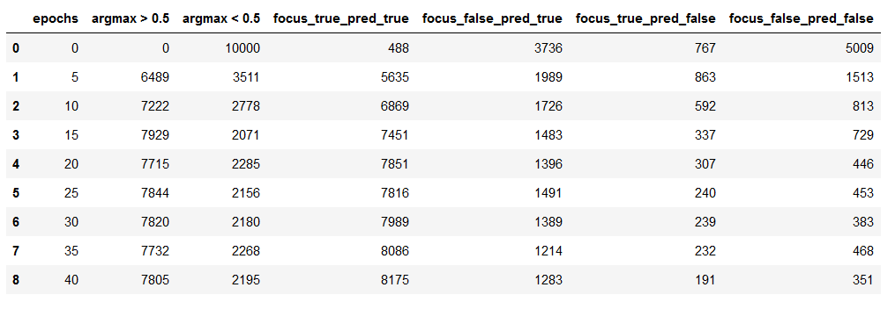
#### Row 3 : | 3 | Focus is Random | Classify is Random | Train Focus | 50 | 33 | 32 |
On Training Data

On Testing Data
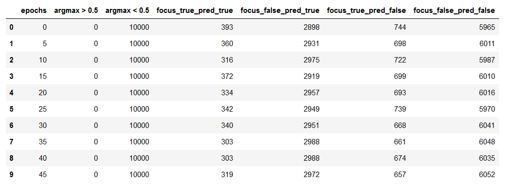
#### Row 4 : | 4 | Focus is Random | Classify is Random | Train Classify | 51 | 99 | 43 |
On Training Data

On Testing Data

#### Row 6 : | 6 | Focus is Pre-Trained | Classify is Random | Train Both | 19 | 99 | 97 |
On Training Data
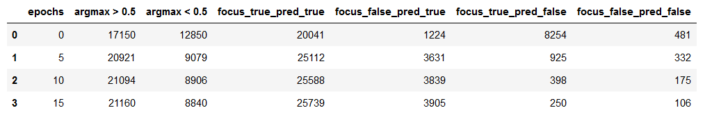
On Testing Data
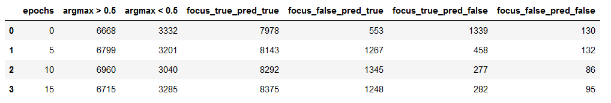
#### Row 7 : | 7 | Focus is Pre-Trained | Classify is Random | Train Focus | 50 | 33 | 33 |
On Training Data

On Testing Data
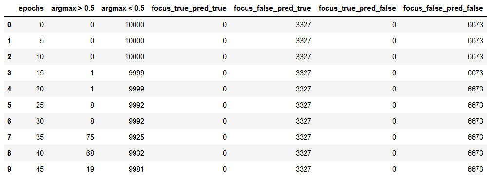
#### Row 8 : | 8 | Focus is Pre-Trained | Classify is Random | Train Classify | 113 | 99 | 90 |
On Training Data

On Testing Data
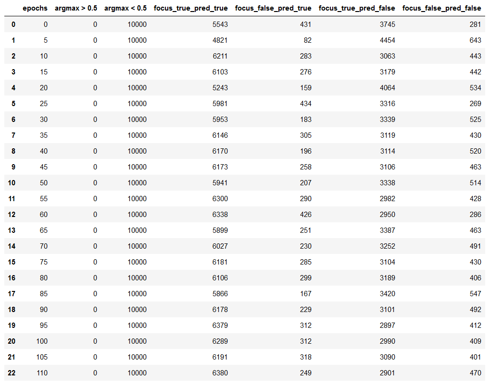
#### Row 10 : | 10 | Focus is Random | Classify is Pre-Trained | Train Both | 52 | 99 | 93 |
On Training Data
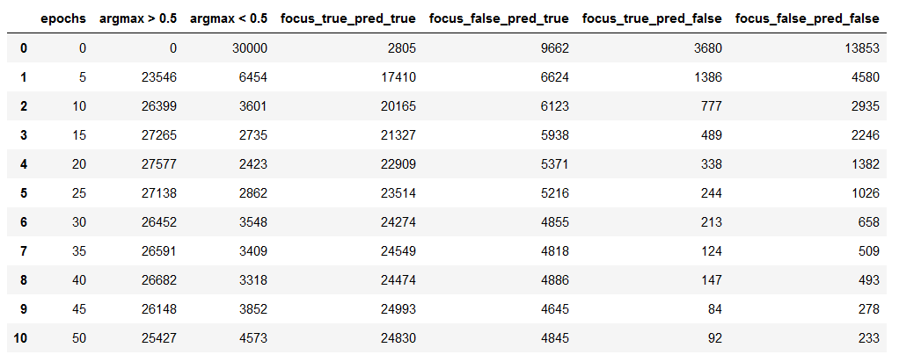
On Testing Data
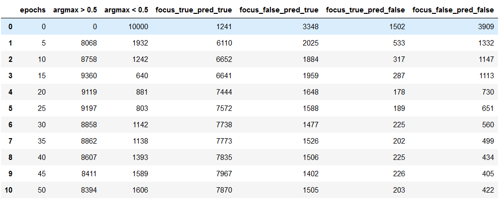
#### Row 11 : | 11 | Focus is Random | Classify is Pre-Trained | Train Focus | 20 | 47 | 45 |
On Training Data
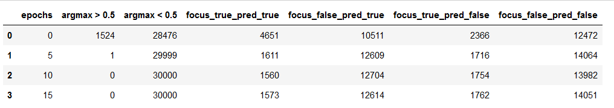
On Testing Data
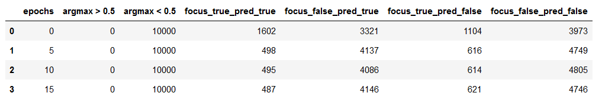
#### Row 12 : | 12 | Focus is Random | Classify is Pre-Trained | Train Classify | 60 | 99 | 44 |
On Training Data
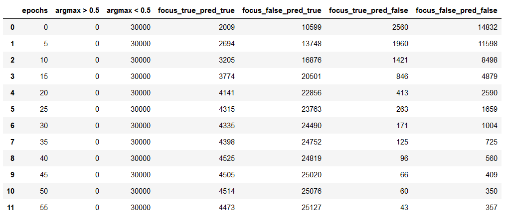
On Testing Data
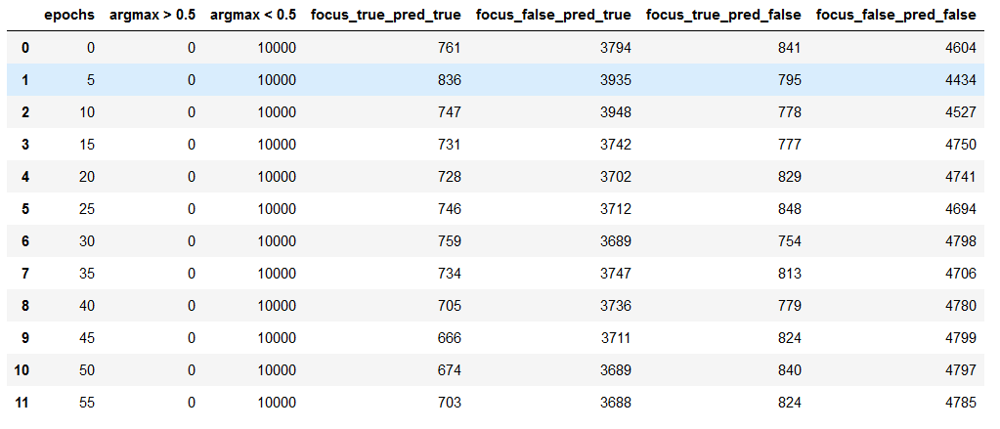
#### Row 14 : | 14 | Focus is Pre-Trained | Classify is Pre-Trained | Train Both | 4 | 99 | 99 |
On Training Data

On Testing Data
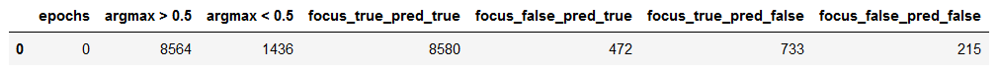
#### Row 15 : | 15 | Focus is Pre-Trained | Classify is Pre-Trained | Train Focus | 200 | 40 | 39 |
On Training Data

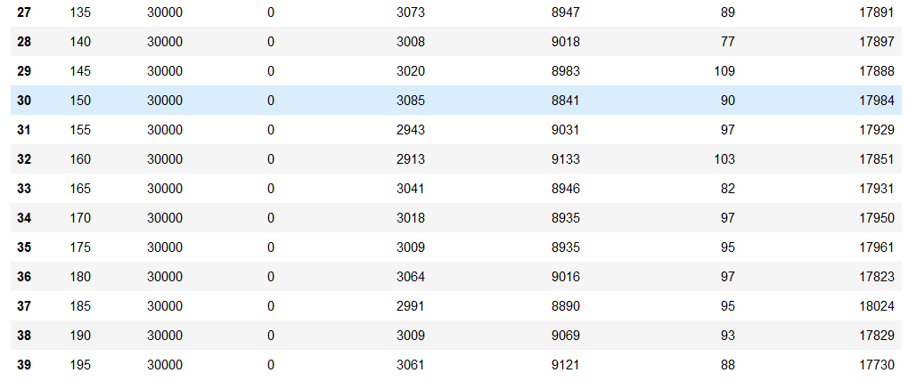
On Testing Data
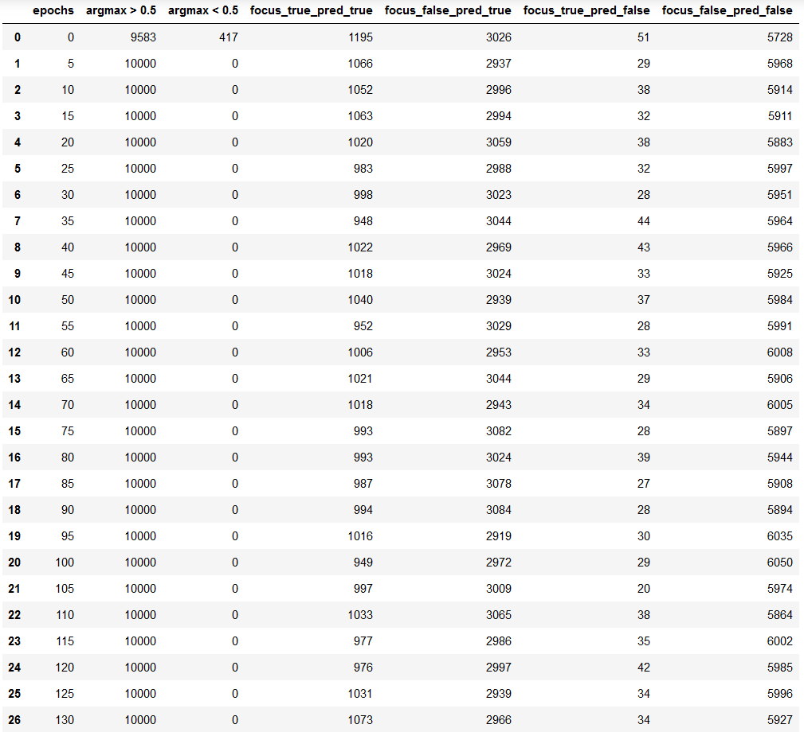
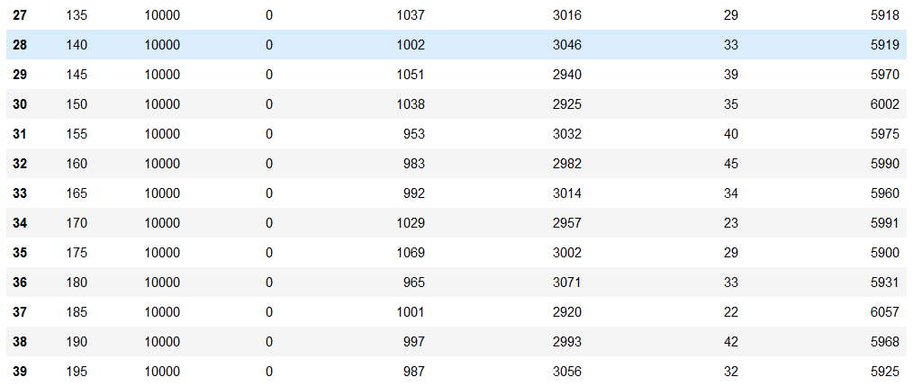
#### Row 16 : | 16 | Focus is Pre-Trained | Classify is Pre-Trained | Train Classify | 11 | 99 | 96 |
On Training Data
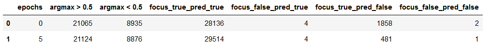
On Testing Data
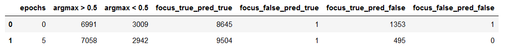

### CNN - 6 Layer Architecture for Focus Net
```python
class Focus(nn.Module):
  def __init__(self):
    super(Focus, self).__init__()
    self.conv1 = nn.Conv2d(in_channels=3, out_channels=32, kernel_size=3, padding=0)
    self.conv2 = nn.Conv2d(in_channels=32, out_channels=64, kernel_size=3, padding=0)
    self.conv3 = nn.Conv2d(in_channels=64, out_channels=128, kernel_size=3, padding=0)
    self.conv4 = nn.Conv2d(in_channels=128, out_channels=128, kernel_size=3, padding=0)
    self.conv5 = nn.Conv2d(in_channels=128, out_channels=128, kernel_size=3, padding=0)
    self.conv6 = nn.Conv2d(in_channels=128, out_channels=128, kernel_size=3, padding=1)
    self.pool = nn.MaxPool2d(kernel_size=2, stride=2)
    self.batch_norm1 = nn.BatchNorm2d(32)
    self.batch_norm2 = nn.BatchNorm2d(128)
    self.dropout1 = nn.Dropout2d(p=0.05)
    self.dropout2 = nn.Dropout2d(p=0.1)
    self.fc1 = nn.Linear(128,64)
    self.fc2 = nn.Linear(64, 32)
    self.fc3 = nn.Linear(32, 10)
    self.fc4 = nn.Linear(10, 1)

  def forward(self,z):  #y is avg image #z batch of list of 9 images
    y = torch.zeros([batch,3, 32,32], dtype=torch.float64)
    x = torch.zeros([batch,9],dtype=torch.float64)
    y = y.to("cuda")
    x = x.to("cuda")
    
    for i in range(9):
        x[:,i] = self.helper(z[:,i])[:,0]

    x = F.softmax(x,dim=1)

    x1 = x[:,0]
    torch.mul(x1[:,None,None,None],z[:,0])
    for i in range(9):            
      x1 = x[:,i]          
      y = y + torch.mul(x1[:,None,None,None],z[:,i])
    return x, y
    
  def helper(self, x):
    x = self.conv1(x)
    x = F.relu(self.batch_norm1(x))

    x = (F.relu(self.conv2(x)))
    x = self.pool(x)
    
    x = self.conv3(x)
    x = F.relu(self.batch_norm2(x))

    x = (F.relu(self.conv4(x)))
    x = self.pool(x)
    x = self.dropout1(x)

    x = self.conv5(x)
    x = F.relu(self.batch_norm2(x))

    x = (F.relu(self.conv6(x)))
    x = self.pool(x)

    x = x.view(x.size(0), -1)

    x = self.dropout2(x)
    x = F.relu(self.fc1(x))
    x = F.relu(self.fc2(x))
    x = self.dropout2(x)
    x = F.relu(self.fc3(x))
    x = self.fc4(x)
    return x
```
### CNN - 6 Layer Architecture for Classify Net
```python
class Classification(nn.Module):
  def __init__(self):
    super(Classification, self).__init__()
    self.conv1 = nn.Conv2d(in_channels=3, out_channels=32, kernel_size=3, padding=0)
    self.conv2 = nn.Conv2d(in_channels=32, out_channels=64, kernel_size=3, padding=0)
    self.conv3 = nn.Conv2d(in_channels=64, out_channels=128, kernel_size=3, padding=0)
    self.conv4 = nn.Conv2d(in_channels=128, out_channels=128, kernel_size=3, padding=0)
    self.conv5 = nn.Conv2d(in_channels=128, out_channels=128, kernel_size=3, padding=0)
    self.conv6 = nn.Conv2d(in_channels=128, out_channels=128, kernel_size=3, padding=1)
    self.pool = nn.MaxPool2d(kernel_size=2, stride=2)
    self.batch_norm1 = nn.BatchNorm2d(32)
    self.batch_norm2 = nn.BatchNorm2d(128)
    self.dropout1 = nn.Dropout2d(p=0.05)
    self.dropout2 = nn.Dropout2d(p=0.1)
    self.fc1 = nn.Linear(128,64)
    self.fc2 = nn.Linear(64, 32)
    self.fc3 = nn.Linear(32, 10)
    self.fc4 = nn.Linear(10, 3)

  def forward(self,x):  
    x = self.conv1(x)
    x = F.relu(self.batch_norm1(x))

    x = (F.relu(self.conv2(x)))
    x = self.pool(x)
    
    x = self.conv3(x)
    x = F.relu(self.batch_norm2(x))

    x = (F.relu(self.conv4(x)))
    x = self.pool(x)
    x = self.dropout1(x)

    x = self.conv5(x)
    x = F.relu(self.batch_norm2(x))

    x = (F.relu(self.conv6(x)))
    x = self.pool(x)

    x = x.view(x.size(0), -1)

    x = self.dropout2(x)
    x = F.relu(self.fc1(x))
    x = F.relu(self.fc2(x))
    x = self.dropout2(x)
    x = F.relu(self.fc3(x))
    x = self.fc4(x)
    return x
```
