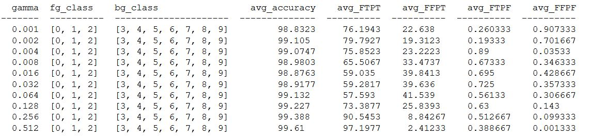
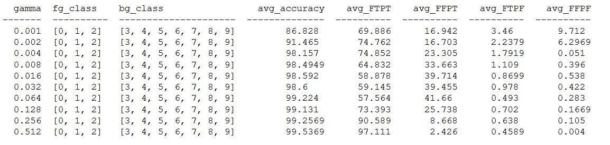
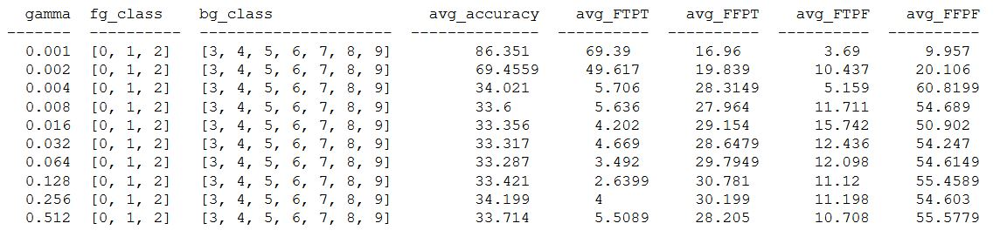
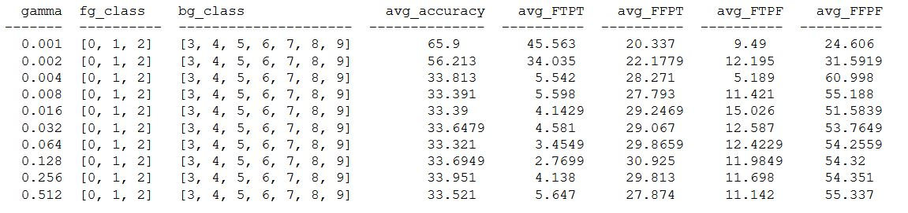

##### Histogram of CIFAR True Training Dataset

##### Histogram of CIFAR True Testing Dataset

### Table 1 : Comparison of histogram with different gamma
| gamma | Histogram Training Dataset | Histogram Testing Dataset |
|---------|--------------------|-------------------------|
|0.001 |   |   |
|0.002 |   |   |
|0.004 |   |   |
|0.008 |   |   |
|0.016 |   |   |
|0.032 |   |   |
|0.064 |   |   |
|0.128 |   |   |
|0.256 |   |   |
|0.512 |   |   |

### Table 2 : Display of u1, u2, u3 vectors as images
| u1 | u2 | u3 |
|----|-----|-----------|
| |  |  |

### Table 3 : Comparison of True vs corrupted images with different gamma
| gamma | true vs corrupted images |
|---------|----------------------------------------|
|0.001 |   |
|0.002 |   |
|0.004 |   |
|0.008 |   |
|0.016 |   |
|0.032 |   |
|0.064 |   |
|0.128 |   |
|0.256 |   |
|0.512 |   |

### Description of Dataset :
1. Training Dataset : 30k mosaic images from 50k modified CIFAR Train

2. Test Dataset 1 : 10k mosaic images from 50k modified CIFAR Train

3. Test Dataset 2 : 10k mosaic images from 10k modified CIFAR Test

4. Test Dataset 3 : 10k mosaic images from 50k True CIFAR Train

5. Test Dataset 4 : 10k mosaic images from 10k True CIFAR Test

### Table 4 : Observation Table for Training Dataset

### Table 5 : Observation Table for Testing Dataset 1

### Table 6 : Observation Table for Testing Dataset 2

### Table 7 : Observation Table for Testing Dataset 3

### Table 8 : Observation Table for Testing Dataset 4

### Plots:
Plot for Training Accuracy

