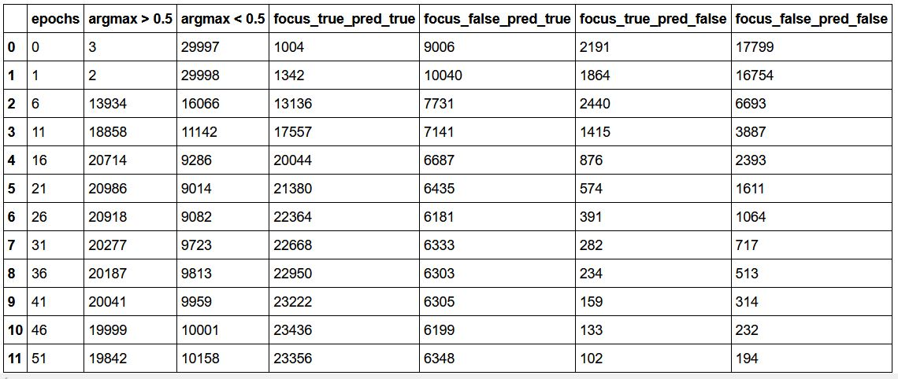
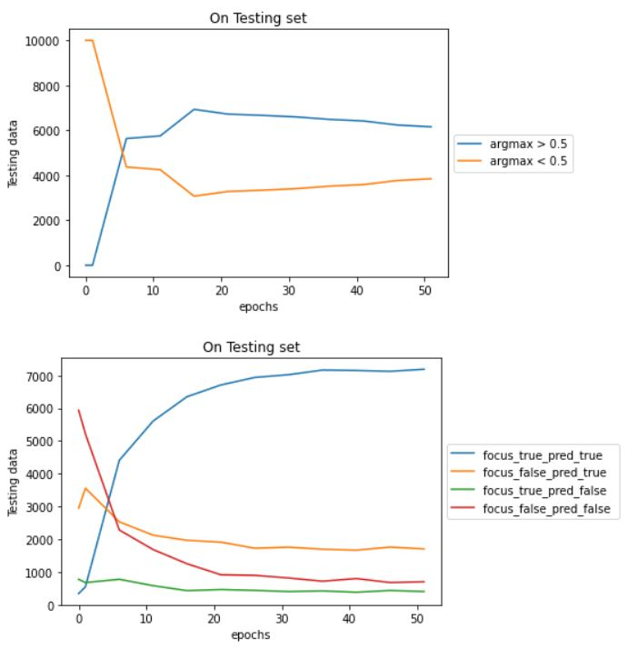
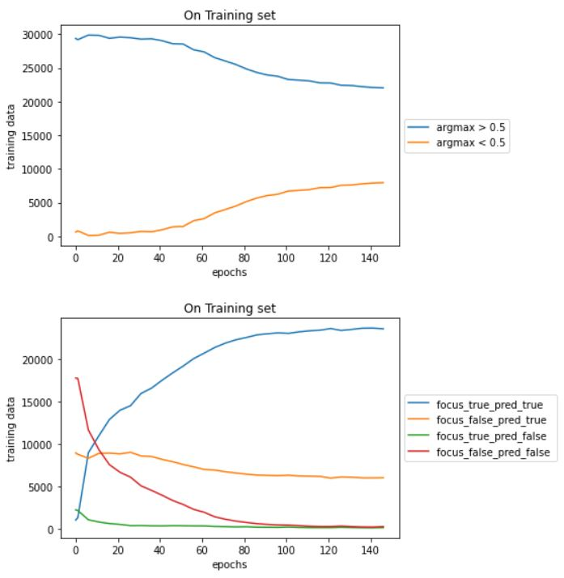
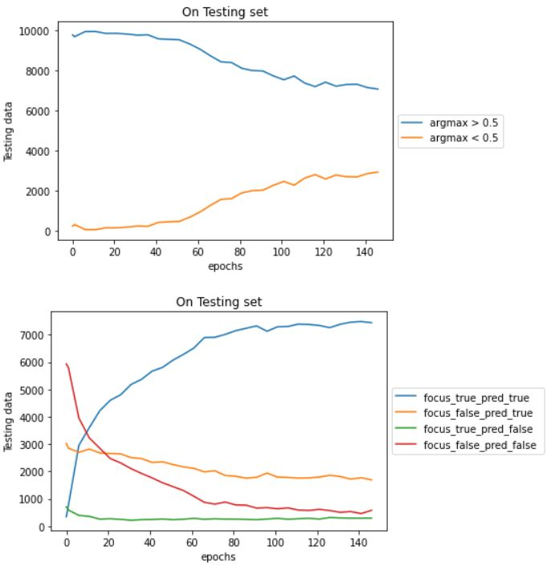
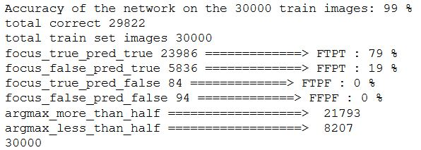
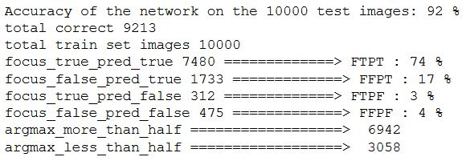
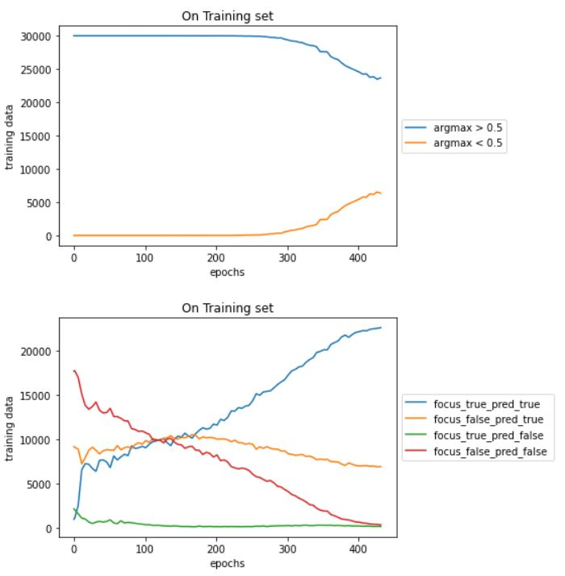
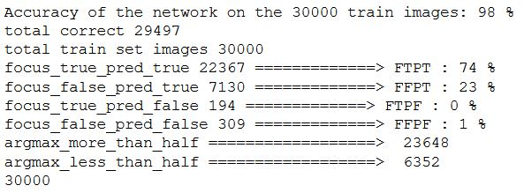

## Experiment Setup
In "Focus random Classify Random Train Both", Initialise the focus net with some standard initialisation (here Xavier uniform) x K (where K = 0.5, 1, 2, 4, 8)

### Observation table for 
|           | K = 0.05  |  K = 1  | K = 2  | K = 4 |
|-----------|-----------|---------|--------|-------|
| On Train  |     |      |      |      |
| Train Acc | |  |  |  |
| On Test   |      |       |       |       |
| Test Acc  |  |   |   |   |

<!--- ### For K = 0.5
On Training Dataset

On Testing Dataset

Training Accuracy

Testing Accuracy

### For K = 1
On Training Dataset

On Testing Dataset

Training Accuracy

### For K = 2
On Training Dataset

On Testing Dataset

Training Accuracy

Testing Accuracy

### For K = 4
On Training Dataset

On Testing Dataset

Training Accuracy

Testing Accuracy
 -->
