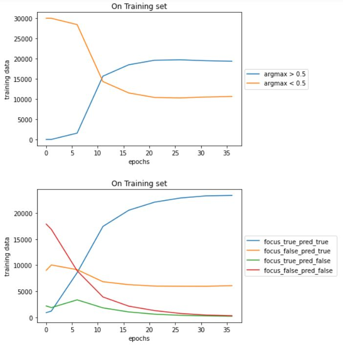
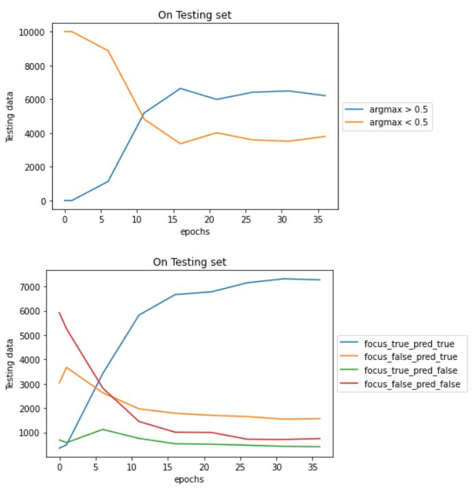
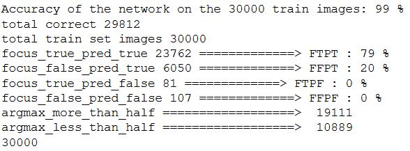

## Experiment Setup
In "Focus random Classify Random Train Both", Initialise the focus net with some standard initialisation x K (where K = 0.5, 1, 2, 4, 8)

### For K = 1
On Training Dataset

On Testing Dataset

Training Accuracy

Testing Accuracy

