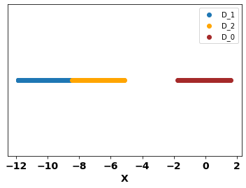

#### Data visualisation

<!--  -->

#### Table 1 : analysis with different weights and biases
Model used is linear focus + linear classifaication
| init weights focus | init weight classify | optimizer | type of training | final weight focus | final weight classify | train acc | test acc |
|--------------------|----------------------|-----------|------------------|---------------------|----------------------|--------|---------|
|[0, 0] | [0, 0] | Adam  |simultaneous  | [-0.2738, 0] | [2.194, 10.332] | 99 | 99 |
|[0, 0] | [0, 0] | Adam  |alternate minmization  | [-0.288, 0] | [1.6446, 7.93] | 99 | 99 |
|[10, 0] | [0, 0] | Adam  |simultaneous  | [10, 0] | [-0.008, 0.0036] | 48 | 48 |
|[10, 0] | [0, 0] | Adam  |alternate minmization  | [10, 0] | [-0.04, 0.076] | 50 | 50 |
|[2, 0] | [0, 0] | Adam  |simultaneous  | [2.0852, 0] | [0.2257, -0.2101] | 50 | 46 |
|[2, 0] | [0, 0] | Adam  |alternate minmization  | [1.9872, 0] | [-0.043, 0.071] | 50 | 48 |
|[1, 0] | [0, 0] | Adam  |simultaneous  | [0.2464, 0] | [-0.764, 0.09] | 50 | 49 |
|[1, 0] | [0, 0] | Adam  |alternate minmization  | [0.3, 0] | [-0.46, 0.13] | 51 | 51 |
|[0.2, 0] | [0, 0] | Adam  |simultaneous  | [0.24, 0] | [-0.759, 0.095] | 55 | 55 |
|[0.2, 0] | [0, 0] | Adam  |alternate minmization  | [0.2478, 0] | [-0.7655, 0.962] | 55 | 55 |
|[0.1, 0] | [0, 0] | Adam  |simultaneous  | [-0.2635, 0] | [3.2872, 14.98] | 100 | 100 |
|[0.1, 0] | [0, 0] | Adam  |alternate minmization  | [-0.2756, 0] | [2.0378, 9.75] | 100 | 100 |
|[0.13, 0] | [0, 0] | Adam  |simultaneous  | [0.24, 0] | [-0.224, 0.0419] | 51 | 47 |
|[0.13, 0] | [0, 0] | Adam  |alternate minmization  | [-0.2734, 0] | [2.0079, 9.8212] | 100 | 100 |
