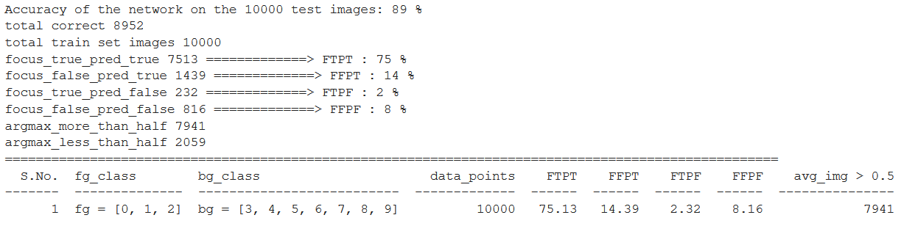
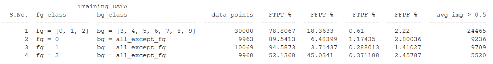
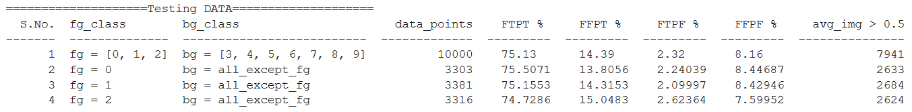
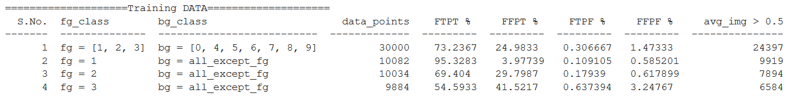
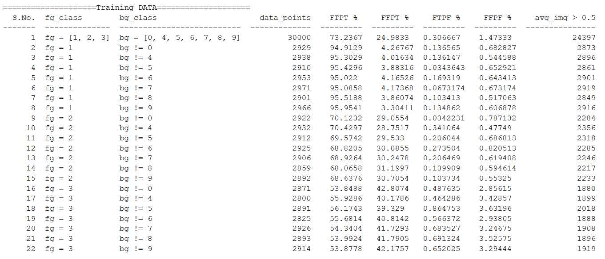
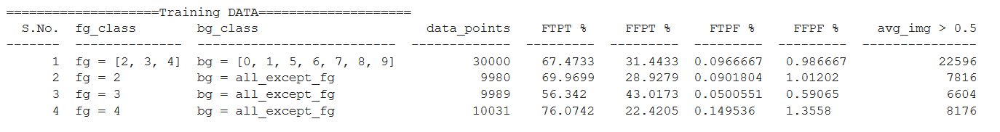
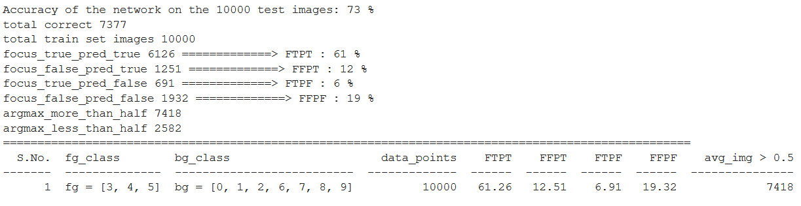
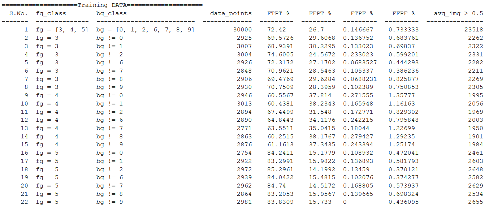

# FG = 0,1,2 and BG = 3,4,5,6,7,8,9
>> Train Accuracy :

>> Test Accuracy:

>> Train Accuracy for each Foreground class:

>> Test Accuracy for each Foreground class:

>> Train Accuracy Analysis for NOT in BG of Set Size 1:

>> Test Accuracy Analysis for NOT in BG of Set Size 1:

# FG = 1,2,3 and BG = 0,4,5,6,7,8,9
>> Train Accuracy :

>> Test Accuracy:

>> Train Accuracy for each Foreground class:

>> Test Accuracy for each Foreground class:

>> Train Accuracy Analysis for NOT in BG of Set Size 1:

>> Test Accuracy Analysis for NOT in BG of Set Size 1:

# FG = 2,3,4 and BG = 0,1,5,6,7,8,9
>> Train Accuracy :

>> Test Accuracy:

>> Train Accuracy for each Foreground class:

>> Test Accuracy for each Foreground class:

>> Train Accuracy Analysis for NOT in BG of Set Size 1:

>> Test Accuracy Analysis for NOT in BG of Set Size 1:

# FG = 3,4,5 and BG = 0,1,2,6,7,8,9
>> Train Accuracy :

>> Test Accuracy:

>> Train Accuracy for each Foreground class:

>> Test Accuracy for each Foreground class:

>> Train Accuracy Analysis for NOT in BG of Set Size 1:

>> Test Accuracy Analysis for NOT in BG of Set Size 1:

