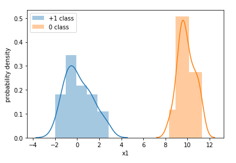
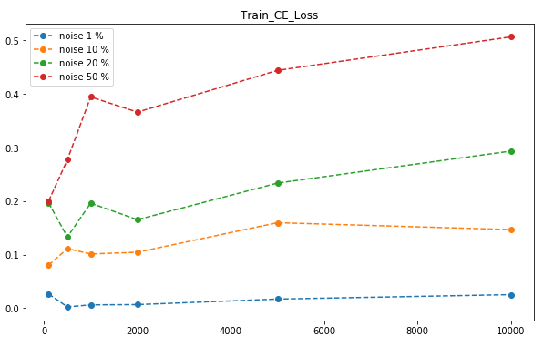
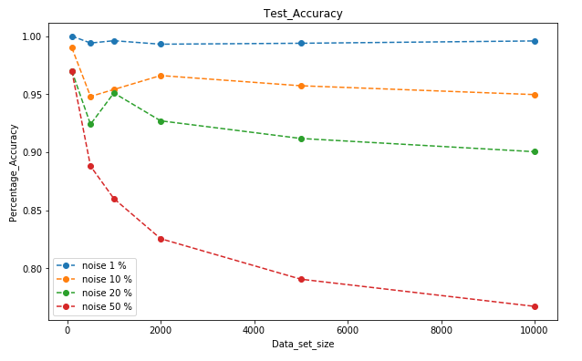
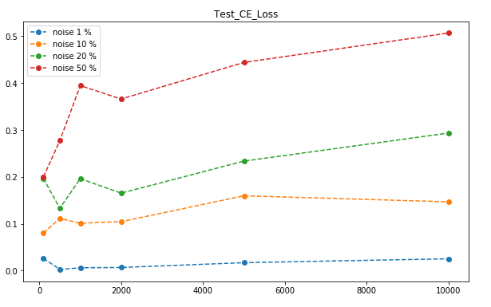

Finding out how the trend is if we corrupt cifar labels by 0,10,20,30,40,50 percentage.
Efficient Net is used.

#### Please read the REPORT FILE attached

###### A better version of code and report is present in Inception Net Folder, where I have used a smaller version of inception net.

  - weights of inception net is also available in inception net folder.
  
## For the Table 1 and Table 2, following data was used in experiment. True Training Data was varying as follows:

| training data | percentage corruption | true training data | corrupted training data |
|:-------------:|:---------------------:|:------------------:|:-----------------------:|
|50000          |0                      |50000               |0                        |
|50000          |5                      |47500               |2500                     |
|50000          |10                     |45000               |5000                     |
|50000          |20                     |40000               |10000                    |
|50000          |30                     |35000               |15000                    |
|50000          |40                     |30000               |20000                    |
|50000          |50                     |25000               |25000                    |
|50000          |100                    |0                   |50000                    |

## Table 1: Analysis of Accuracy on Training & Testing Data

| corruption level                                          | Train accuracy on corrupted train-data |               |        | Test accuracy on corrupted test data  |              |        | Test accuracy on true data |
|:---------------------------------------------------------:|----------------------------------------|---------------|--------|---------------------------------------|--------------|--------|----------------------------|
|                                                           | corrupted                              | un-corrupted  | full   | corrupted                             | un-corrupted | full   |                            |
| 0%                                                        | -NIL-                                  | 1             | 1      | -NIL-                                 | -NIL-        | -NIL-  | 0.83                       |
| 5%                                                        | 1                                      | 1             | 1      | 0.0858                                | 0.7830       | 0.7481 | 0.78                       |
| 10%                                                       | 1                                      | 1             | 1      | 0.1028                                | 0.7509       | 0.6841 | 0.75                       |
| 20%                                                       | 1                                      | 1             | 1      | 0.1028                                | 0.6659       | 0.5505 | 0.66                       |
| 30%                                                       | 1                                      | 1             | 1      | 0.1019                                | 0.5864       | 0.4405 | 0.58                       |
| 40%                                                       | 1                                      | 1             | 1      | 0.1031                                | 0.5058       | 0.3462 | 0.50                       |
| 50%                                                       | 1                                      | 1             | 1      | 0.0970                                | 0.4252       | 0.2625 | 0.42                       |
| 100%                                                      | 0.99                                   | -NIL-         | 0.99   | 0.1084                                | -NIL-        | 0.1084 | 010                        |
|                                                           |                                        |               |        |                                       |              |        |                            |

## Table 2: Analysis of Cross Entropy Loss on Training & Testing Data

| corruption level                                          | Train cross entropy loss on train-data |               |        | Test cross entropy loss on train-data |              |        | Test CE loss on true data  |
|:---------------------------------------------------------:|----------------------------------------|---------------|--------|---------------------------------------|--------------|--------|----------------------------|
|                                                           | corrupted                              | un-corrupted  | full   | corrupted                             | un-corrupted | full   |                            |
| 0%                                                        | -NIL-                                  | 0.0014        | 0.0014 | -NIL-                                 | -NIL-        | -NIL-  | 0.7550                     |
| 5%                                                        | 0.0008                                 | 0.0001        | 0.0002 | 11.9317                               | 1.0995       | 1.6422 | 1.1018                     |
| 10%                                                       | 0.0005                                 | 0.0001        | 0.0002 | 11.2546                               | 1.3577       | 2.3781 | 1.3478                     |
| 20%                                                       | 0.0004                                 | 0.0001        | 0.0002 | 10.2894                               | 1.8734       | 3.5995 | 1.8783                     |
| 30%                                                       | 0.0004                                 | 0.0001        | 0.0002 | 9.8259                                | 2.4355       | 4.6615 | 2.4304                     |
| 40%                                                       | 0.0004                                 | 0.0002        | 0.0002 | 9.3006                                | 2.9981       | 5.4971 | 3.0478                     |
| 50%                                                       | 0.0004                                 | 0.0002        | 0.0003 | 9.1102                                | 3.9016       | 6.4840 | 3.9291                     |
| 100%                                                      | 0.0014                                 | -NIL-         | 0.0014 | 9.1871                                | -NIL-        | 9.1871 |                            |

## For the Table 3 and Table 4, following data was used in experiment. True Training Data was constant:

| training data | percentage corruption | true training data | corrupted training data |
|:-------------:|:---------------------:|:------------------:|:-----------------------:|
|25000          |0                      |25000               |0                        |
|26315          |5                      |25000               |1315                     |
|27777          |10                     |25000               |2777                     |
|31250          |20                     |25000               |6250                     |
|35714          |30                     |25000               |10714                    |
|41666          |40                     |25000               |16666                    |
|50000          |50                     |25000               |25000                    |
|50000          |100                    |0                   |50000                    |

## Table 3: Analysis of Accuracy on Training & Testing Data

| corruption level                                          | Train accuracy on corrupted train-data |               |        | Test accuracy on corrupted test data  |              |        | Test accuracy on true data |
|:---------------------------------------------------------:|----------------------------------------|---------------|--------|---------------------------------------|--------------|--------|----------------------------|
|                                                           | corrupted                              | un-corrupted  | full   | corrupted                             | un-corrupted | full   |                            |
| 0%                                                        | -NIL-                                  | 1             | 1      | -NIL-                                 | -NIL-        | -NIL-  | 0.83                       |
| 5%                                                        | 1                                      | 1             | 1      | 0.0978                                | 0.7496       | 0.717  | 0.75                       |
| 10%                                                       | 1                                      | 1             | 1      | 0.0844                                | 0.7161       | 0.651  | 0.71                       |
| 20%                                                       | 1                                      | 1             | 1      | 0.0961                                | 0.6486       | 0.5353 | 0.64                       |
| 30%                                                       | 1                                      | 1             | 1      | 0.1019                                | 0.5755       | 0.4329 | 0.57                       |
| 40%                                                       | 1                                      | 1             | 1      | 0.1047                                | 0.5077       | 0.3479 | 0.50                       |
| 50%                                                       | 1                                      | 1             | 1      | 0.1035                                | 0.4254       | 0.2658 | 0.42                       |
| 100%                                                      | 0.99                                   | -NIL-         | 0.99   | 0.1084                                | -NIL-        | 0.1084 | 010                        |
|                                                           |                                        |               |        |                                       |              |        |                            |

## Table 4: Analysis of Cross Entropy Loss on Training & Testing Data

| corruption level                                          | Train cross entropy loss on train-data |               |        | Test cross entropy loss on train-data |              |        | Test CE loss on true data  |
|:---------------------------------------------------------:|----------------------------------------|---------------|--------|---------------------------------------|--------------|--------|----------------------------|
|                                                           | corrupted                              | un-corrupted  | full   | corrupted                             | un-corrupted | full   |                            |
| 0%                                                        | -NIL-                                  | 0.0014        | 0.0014 | -NIL-                                 | -NIL-        | -NIL-  | 0.7550                     |
| 5%                                                        | 0.0029                                 | 0.0008        | 0.0009 | 9.0802                                | 1.0603       | 1.4621 | 1.0695                     |
| 10%                                                       | 0.0011                                 | 0.0004        | 0.0004 | 9.0299                                | 1.2622       | 2.0631 | 1.2633                     |
| 20%                                                       | 0.0010                                 | 0.0004        | 0.0005 | 8.7882                                | 1.6304       | 3.0984 | 1.6466                     |
| 30%                                                       | 0.0006                                 | 0.0003        | 0.0004 | 8.6061                                | 2.2097       | 4.1363 | 2.2062                     |
| 40%                                                       | 0.0007                                 | 0.0003        | 0.0005 | 8.7873                                | 2.8716       | 5.2171 | 2.8760                     |
| 50%                                                       | 0.0014                                 | 0.0008        | 0.0011 | 8.9452                                | 3.7132       | 6.3072 | 3.7541                     |
| 100%                                                      | 0.0014                                 | -NIL-         | 0.0014 | 9.1871                                | -NIL-        | 9.1871 |                            |

# Synthetic Data
### What if Noise is added to this synthetic data, How will be the Accuracy and CE Loss:
  
  
  
  
  
