## Error Mode 3 Focus and classification illustration

### distribution 1

#### linear focus and linear classification
| epochs | 0   |  10 | 20  | 50  | 250 |  final |
| -- | -- | -- | -- | -- | -- | -- |
| focus illustration | 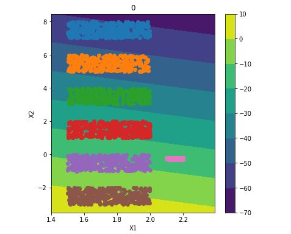| 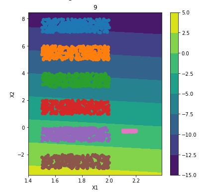| 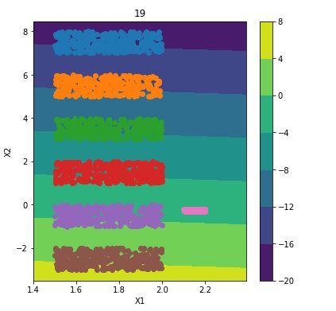 | 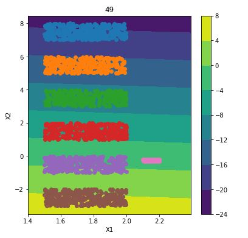 | 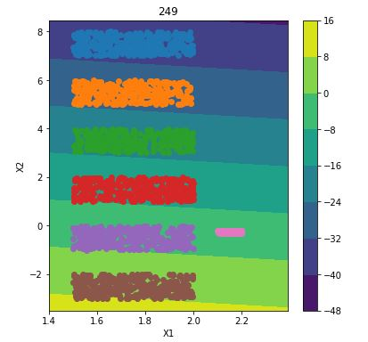 | 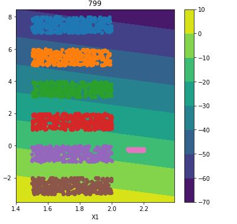 |
| classification illustration |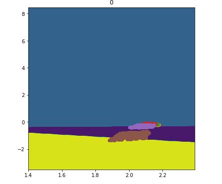 | 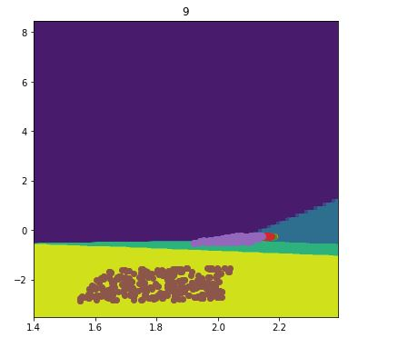 | 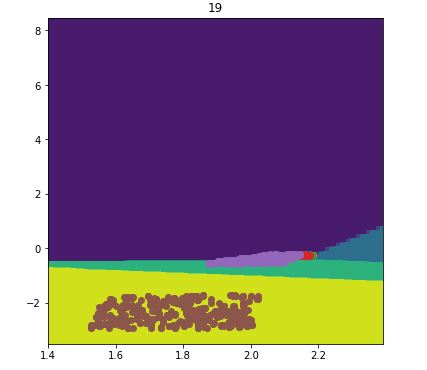 | 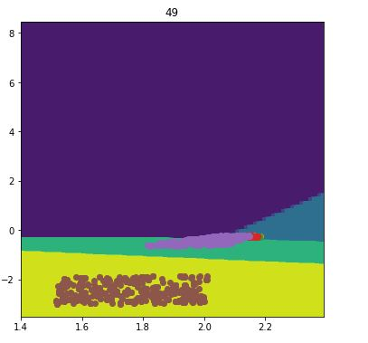 | 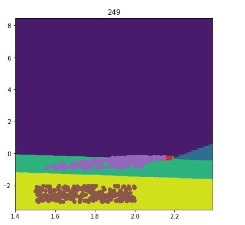 | 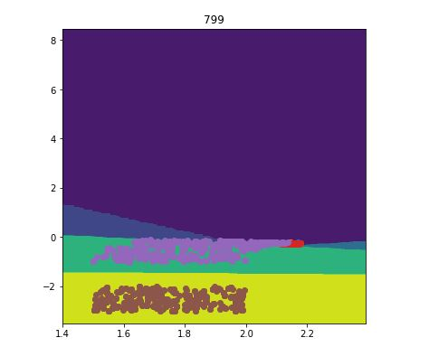 |

#### linear focus and non-linear classification

| epochs | 0   |  10 | 20  | 50  |  final |
| -- | -- | -- | -- | -- | -- |
| focus illustration | | | | | |
| classification illustration | | | | | |

#### non-linear focus and non-linear classification

| epochs | 0   |  10 | 20  | 50  |  final |
| -- | -- | -- | -- | -- | -- |
| focus illustration | | | | | |
| classification illustration | | | | | |

### distribution2

#### linear focus and linear classification

| epochs | 0   |  10 | 20  | 50  |  final |
| -- | -- | -- | -- | -- | -- |
| focus illustration | | | | | |
| classification illustration | | | | | |

#### linear focus and non-linear classification

| epochs | 0   |  10 | 20  | 50  |  final |
| -- | -- | -- | -- | -- | -- |
| focus illustration | | | | | |
| classification illustration | | | | | |

#### non-linear focus and non-linear classification

| epochs | 0   |  10 | 20  | 50  |  final |
| -- | -- | -- | -- | -- | -- |
| focus illustration | | | | | |
| classification illustration | | | | | |

