  ### Attention is required only when data is not linearly separable D_1  K_2 NF_2 NB_1
  
  # Mosaic Data is not linearly separable
    - data distribution
    
    
  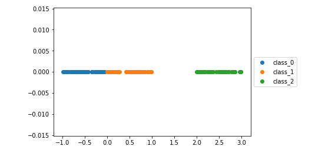
    
   - Mosaic Data
    
   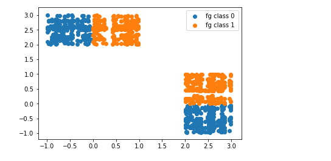
    
  - Learning attention weights 
  
     # Not good attention weights
     - At epoch zero
    
    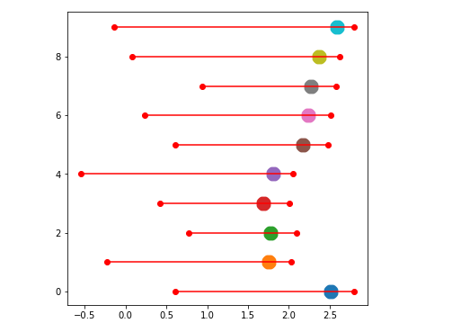
    
    
    - At epoch hundred
    
    
    
    
    -  Accuracy 58.7%
     
     
     # good attention weights
     - At epoch zero
    
    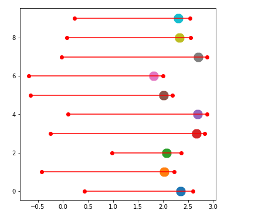
    


     - At epoch hundred 
    
    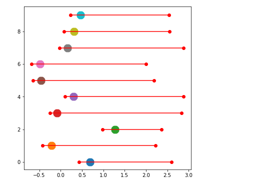
    
    


    - Accuracy 99.1%
    
    
    
    
    # Mosaic Data is linearly separable
    - data distribution
    
    
  
    
   - Mosaic Data
    
   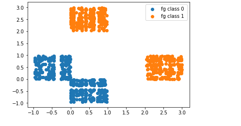
    
  - Learning attention weights 

     - At epoch zero
    
    
     
     - At epoch hundred
    
    
    
    -  Accuracy 100%
    
  
### D_2 K_3 NF_2 NB_1  
  # When Data is not linearly Separable


|Data Distribution   | Linear SVM Accuracy on Mosaic Data |  Deep Network Accuracy on Mosaic Data | Linear Attention network Accuracy | Deep Attention Newtork Accuracy | Analysis Linear Attention Network | Analysis Deep Attention Network |
| ------------------ | ----------------------------------- | ------------------------------------ | ------------------- | ------------------------------------------------- | ----------------------- | ------------------------------ |
|   | 75 |  80 |  100 | 100 |   |    |
|   | 82 |  90.1 |  100 | 100 |   |    | 
|   | 63.03  |  99.23 | 74.46  | 91.1 |   |    | 


|   Focus Map epoch 1 | Classification  Map epoch 1 |  Focus Map epoch last | Classification  Map epoch last | 
|  ------------------ | --------------------------- |  ----------- | --------------------------- | 
|  |   |   |   |
|  |   |   |   |
|  |   |   |   |
|  |   |   |   |
|  |   |   |   |
|  |   |   |   |


| Data    | Fg vs Bg Score(Linear) | fg1 vs fg2 score(Linear) | Fg vs Bg Score(Deep)  | Fg1 vs Fg2 Score(Deep)    | Linear SVM score(Mosaic) | Linear Attention Network Score | Deep Attention Network Score| Deep Network Score(Mosaic data)  | 
| --------| ---------------------- | ------------------------ | ------------------------ | ----------------------------- | ---------------------------- | ------------------  |   --------- | ------------------- |
| D_1_K_2 |    100  |   100    |  100 | 100  |    59 |      99.6   |  100   |  100  |  
| D_1_K_2 |    68    |  100        | 100 | 100  |   100  |     58.7 /99      |    99   |   100      | 
| D_3_K_5 |    80     |       87.43     | 85.6 | 89  |   62     |     76.73    |    86.9       |      95.86    | |
| D_4_K_5 |    80.4   |       89.89     | 83.6 | 91.19 |    68    |     80       |     88.93     |     95.7      ||
| D_4_K_10|    80.4   |       89.39     | 83.4 | 90.90  |   62.56  |     73.86    |     87.06     |     98.8      ||
| D_5_K_5 |    86.2   |       83.33     | 92  | 89.39 |   62.9   |     80.33    |     96.36     |    98.2       ||
| D_5_K_10|    86.4   |       83.83     | 92.4 | 92.42 |   60.1   |     78.4     |     95.93     |   99.76       ||
| D_10_K_3|     81.8  |   85.22         |  90.2 | 92.11 |    73.76      |    83          |    99.56           |    100           |  
| D_10_K_5|     81.6  |    86.2         | 89.8  |  93.1 |    70.26      |   80.56           |          99.73     | 100            |  
| D_40_K_5|     81.8  |   94         | 100  |  100 |   - | 87.73    |   100           |          99.73     | 100            |
| D_100_K_5|   86  |   100       |  100   |   100 | - | 92.46 |    100  |100 |
<!---| D_3_K_5 |    91     |       93.1      |   |  |   63.8   |     91.6     |    96.1       |     98.2      | |--->


| Data     |  Linear Attention Trends                    |    Deep Attention Trends                    |
| ------   |  ---------------------------------------    |    --------------------------------------   |
| D_1_K_2  |   |   |
| D_1_K_2  |   |   |
| D_3_K_5  |   |   |
| D_3_K_5  |   |   |
| D_4_K_5  |   |   |
| D_4_K_10 |  |   |
| D_5_K_5  |   |   |
| D_5_K_10 |  |   |
| D_10_K_3 |  |  |
| D_10_K_5 |  |  |
| D_40_K_5 |  |  |
| D_100_K_5 |  |  |

| Data            | D_10_K_3 | D_10_K_5 | D_40_K_5 | D_100_K_5 |  
| --------------  | -------- | -------- | -------- |   ------- |
|Pretrained Score(No training) linear | 71.36 | 79.33 | 82.8 | 85.06 |
|Pretrained Score(No training) deep | 88.73 | 88.03 | 100 | 100 |


### Deep Attention Model
```python
class Focus_deep(nn.Module):
    '''
       deep focus network averaged at zeroth layer
       input : elemental data
    '''
    def __init__(self,inputs,output,K,d):
        super(Focus_deep,self).__init__()
        self.inputs = inputs
        self.output = output
        self.K = K
        self.d  = d
        self.linear1 = nn.Linear(self.inputs,50)  #,self.output)
        self.linear2 = nn.Linear(50,self.output) 
    def forward(self,z):
        batch = z.shape[0]
        x = torch.zeros([batch,self.K],dtype=torch.float64)
        y = torch.zeros([batch,self.d], dtype=torch.float64)
        #x,y = x.to("cuda"),y.to("cuda")
        for i in range(self.K):
            x[:,i] = self.helper(z[:,self.d*i:self.d*i+self.d])[:,0]
        x = F.softmax(x,dim=1)   # alphas
        x1 = x[:,0]
        for i in range(self.K):
            x1 = x[:,i]          
            y = y+torch.mul(x1[:,None],z[:,self.d*i:self.d*i+self.d])
        return y , x 
    def helper(self,x):
      x = F.relu(self.linear1(x))
      x = self.linear2(x)
      return x

class Classification_deep(nn.Module):
    '''
       input : elemental data
       deep classification module data averaged at zeroth layer
    '''
    def __init__(self,inputs,output):
        super(Classification_deep,self).__init__()
        self.inputs = inputs
        self.output = output
        self.linear1 = nn.Linear(self.inputs,50)
        self.linear2 = nn.Linear(50,self.output)

    def forward(self,x):
      x = F.relu(self.linear1(x))
      x = self.linear2(x)
      return x    
```
### Synthetic Data Pretrained Models(Cheating)
#### Exp 1
D_4 K_10 (Linear Model)
| s.no| Focus Init      | Classification Init        | Training Module          | Training Acuracy  | Analysis                                                        |
|--- | --------------- | -------------------------- | ------------------------ | -----------   | -----------------------------------------------------------         |
|1 | Random          | Random                     |   -                      |    51.20      | NA                                                                  |
|2 | Random          | Random                     |   Both                   |    73.73      |    |               
|3| Random          | Random                     |   Focus                  |    62.7       |      |
|4| Random          | Random                     |   classify               |    59.96      |   |
|5| Pretrained      | Random                     |   -                      |    49.86      | NA                                                                  |
|6| Pretrained      | Random                  |   Both                   |    74.76      |       |               
|7| Pretrained      | Random                     |   Focus                  |    50.06      |      |
|8| Pretrained      | Random                     |   classify               |  73.63        |    | 
|9| Random          | Pretrained                |   -                      |    56.56      | NA                                                                  |
|10| Random          | Pretrained              |   Both                   |    73.8       |       |               
|11| Random          | Pretrained               |   Focus                  |    71.9       |      |
|12| Random          | Pretrained                 |   classify               |    54.5       |   |    
|13| Pretrained      | Pretrained                 |   -                      | 73.46         | NA                                                                  |
|14| Pretrained      | Pretrained                 |   Both                   | 74.6          |      |           
|15| Pretrained      | Pretrained                 |   Focus                  | 73.63         |     |
|16 | Pretrained      | Pretrained                 |   classify               |   73.3        |   | 


#### Exp 2
D_4 K_10 (Deep Model)
|sno | Focus Init      | Classification Init        | Training Module          | Training Acuracy  | Analysis                                                        |
|-- | --------------- | -------------------------- | ------------------------ | -----------   | -----------------------------------------------------------         |
|1| Random          | Random                     |   -                      |    50.56      | NA                                                                  |
|2| Random          | Random                   |   Both                   |    89.26      | |               
|3| Random          | Random                    |   Focus                  |    50.66       | |
|4| Random          | Random                   |   classify               |    64.2     |   |
|5| Pretrained      | Random                   |   -                      |    47.46      | NA                                                                  |
|6| Pretrained      | Random                  |   Both                   |   91.33     |    |              
|7| Pretrained      | Random                   |   Focus                  |    68.26     |      |
|8| Pretrained      | Random                   |   classify               |  79.13        |    | 
|9| Random          | Pretrained               |   -                      |    56.6     | NA                                                                  |
|10| Random          | Pretrained               |   Both                   |    89.33  |     |               
|11| Random          | Pretrained               |   Focus                  |    85.9     |      |
|12| Random          | Pretrained               |   classify               |    61.1       |   |    
|13| Pretrained      | Pretrained              |   -                      | 75.7          | NA                                                                  |
|14| Pretrained      | Pretrained                 |   Both                   | 90.33         |   |           
|15| Pretrained      | Pretrained                 |   Focus                  | 88.36        |     |
|16| Pretrained      | Pretrained                 |   classify               |  88.73       |   |   


#### Exp 3
D_4 K_10 ( linear-deep Model)
|s no| Focus Init      | Classification Init        | Training Module          | Training Acuracy  | Analysis                                                        |
|--| --------------- | -------------------------- | ------------------------ | --------- | -----------------------------------------------------------         |
|1| Random          | Random                     |   -                      |   51.3    | NA                                                                  |
|2| Random          | Random                     |   Both                   |   77.33   ||               
|3| Random          | Random                     |   Focus                  |   70.76   | |
|4| Random          | Random                     |   classify               |   65      |   |
|5| Pretrained      | Random                     |   -                      |   52.86  | NA                                                                  |
|6| Pretrained      | Random                     |   Both                   | 77.8   |   |               
|7| Pretrained      | Random                     |   Focus                  | 64.7    |     |
|8| Pretrained      | Random                     |   classify               |    75.3 |    | 
|9| Random          | Pretrained                 |   -                      | 61.13     | NA                                                                  |
|10| Random          | Pretrained                 |   Both                   | 77.16    | |               
|11| Random          | Pretrained                 |   Focus                  |  73.1    |      |
|12| Random          | Pretrained                 |   classify               |   65.26  |   |    
|13| Pretrained      | Pretrained                 |   -                      |   72.66   | NA                                                                  |
|14| Pretrained      | Pretrained                 |   Both                   |   77.23  |  |            
|15| Pretrained      | Pretrained                 |   Focus                  |    72.8  |    |
|16| Pretrained      | Pretrained                 |   classify               |   75.06      |  |     


#### Exp 4
D_4 K_10 ( deep-linear Model)
|s.no| Focus Init      | Classification Init        | Training Module          | Training Acuracy  | Analysis                                                        |
|--| --------------- | -------------------------- | ------------------------ | --------- | -----------------------------------------------------------         |
|1| Random          | Random                     |   -                      |   47.4   | NA                                                                  |
|2| Random          | Random                     |   Both                   |   88     ||               
|3| Random          | Random                     |   Focus                  |   77.06   | |
|4| Random          | Random                     |   classify               |   61.83      |   |
|5| Pretrained      | Random                     |   -                      |   72.9  | NA                                                                  |
|6| Pretrained      | Random                     |   Both                   | 89.6   |   |               
|7| Pretrained      | Random                     |   Focus                  | 63.06   |     |
|8| Pretrained      | Random                     |   classify               |    75.1 |    |
|9| Random          | Pretrained                 |   -                      | 57.03     | NA                                                                  |
|10| Random          | Pretrained                 |   Both                   | 87.93    | |               
|11| Random          | Pretrained                 |   Focus                  |  85.76    |      |
|12| Random          | Pretrained                 |   classify               |   64.36  |   |     
|13| Pretrained      | Pretrained                 |   -                      |   74.83   | NA                                                                  |
|14| Pretrained      | Pretrained                 |   Both                   |   90.26  |  |            
|15| Pretrained      | Pretrained                 |   Focus                  |    86.26  |    |
|16| Pretrained      | Pretrained                 |   classify               |   75.06      |  |     


<!--- | Data_distribution  | Linear SVM score |Deep NN Score| Accuracy | Analysis  |
| ------------------ | ---------------- | ----------- |-------- | --------  |
|  | 66.4 | 67.1875 | 79.7 |   |
|  |  62.2 | 69.2 | 69.1 |   |
|  | 59.375 | 80.9 | 100.0 |   |
|  |  77.60 | 81.28 |92.2|   |
|  | 66.97  | 78.32 |87.1|   |
|  | 68.2  | 88.150 | 96.4 |   |---!>


     
 


   <!--- # When Data is linearly Separable
   - Data Distribution
     
      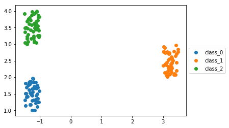
   
   - SVM with Linear Kernel with C value 1000
      - Score 1  (Suggesting Mosaic data is linearly separable)
    
      
    
   - At epoch zero
              
      
   - Focus Map 

      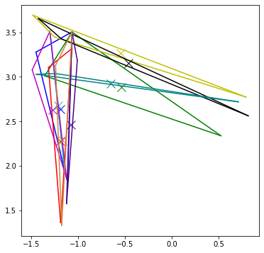
      
      
      
      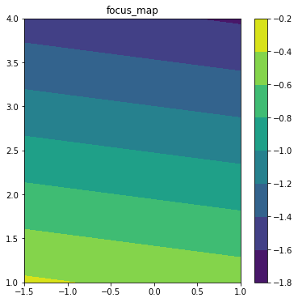


   
   - Classification Map
       

      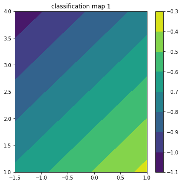
      
            
      

   - At epoch hundred
    
   

   - Focus Map 

      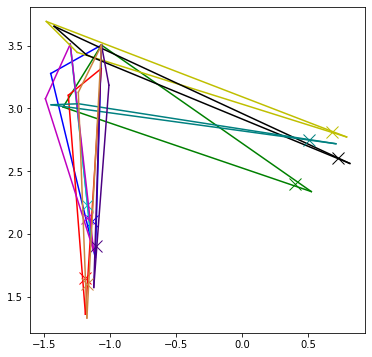
      
      
      
      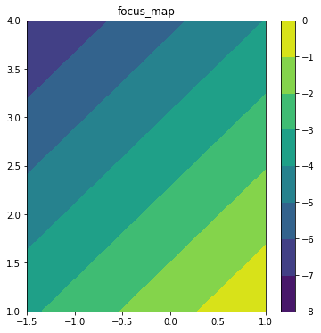


   
   - Classification Map
       

      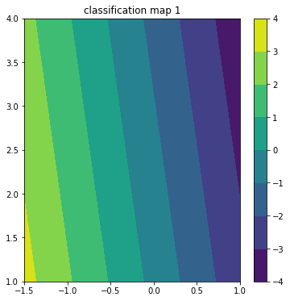

     

      
      
      
      
     
   - Accuracy 100% -->
    
# Observations 
  - When mosaic data is not linearly separable 
     - The models needs attention to learn a good classifier.
     - For higher dimension once it learns some good attention weights, the attention weight learning stops.
  - When mosaic data is linearly separable
     - The model does not need attention to learn a good classifier.
     - For higher dimension model need not require to learn the attention weights, but is sometimes learning good attention weights.
