  ### Attention is required only when data is not linearly separable D_1  K_2 NF_2 NB_1
  
  # Mosaic Data is not linearly separable
    - data distribution
    
    
  
    
   - Mosaic Data
    
   
    
  - Learning attention weights 
  
     # Not good attention weights
     - At epoch zero
    
    
    
    
    - At epoch hundred
    
    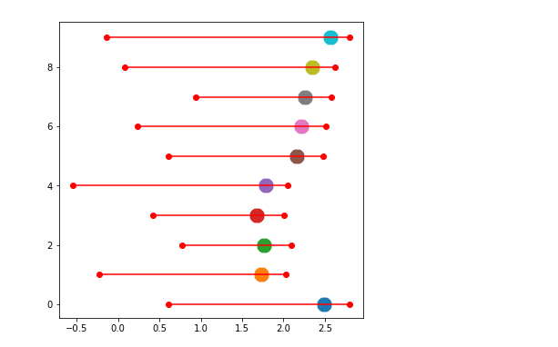
    
    
    -  Accuracy 58.7%
     
     
     # good attention weights
     - At epoch zero
    
    
    

     - At epoch hundred 
    
    
    
    

    - Accuracy 99.1%
    
    
    
    
    # Mosaic Data is linearly separable
    - data distribution
    
    
  
    
   - Mosaic Data
    
   
    
  - Learning attention weights 

     - At epoch zero
    
    
     
     - At epoch hundred
    
    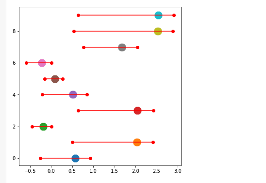
    
    -  Accuracy 100%
    
  
### D_2 K_3 NF_2 NB_1
  # When Data is not linearly Separable
   - Data Distribution
     
      
   
   - SVM with Linear Kernel with C value 1000
      - Score 0.984  (Suggesting Mosaic data is not linearly separable)
    
      
    
   - At epoch zero
      
      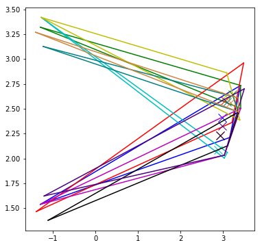
      
        - Focus output map
    
    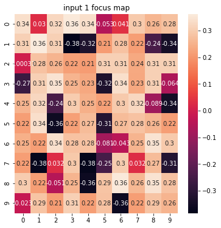
    
    
    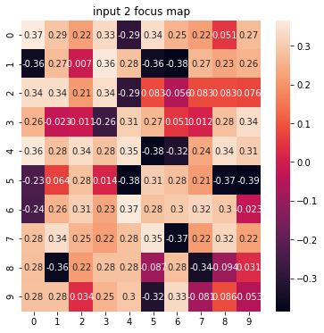

    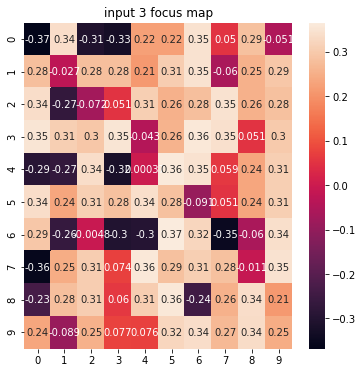
    
   - Classification output map    
     
     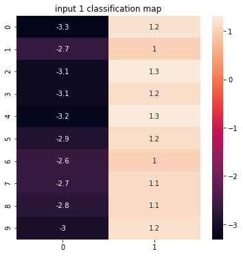    
      
      
 
   - At epoch fifty
      
      
      
          
       
    
    
   - Focus output map
    
    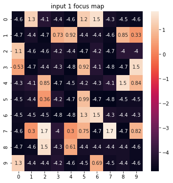
    
    
    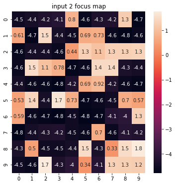

    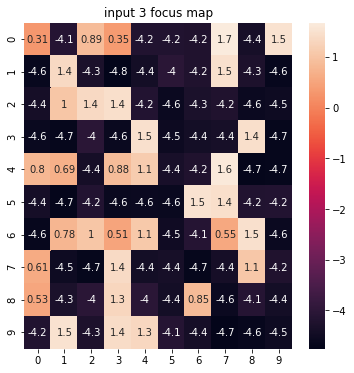
    
   - Classification output map    
     
     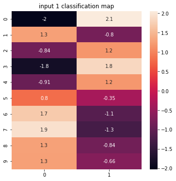   
   
   
   - At epoch hundred
    
       
     

    
   - Focus output map
    
    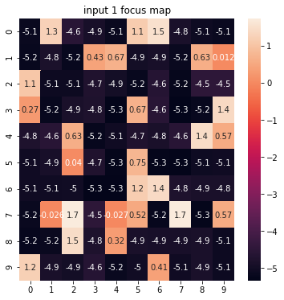
    
    
    

    
    
   - Classification output map    
     
     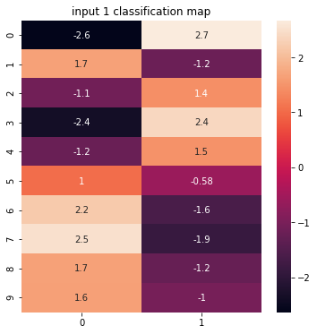  
     
     
   - Accuracy 100%
   
   
   
   # When Data is linearly Separable
   - Data Distribution
     
      
   
   - SVM with Linear Kernel with C value 1000
      - Score 1  (Suggesting Mosaic data is linearly separable)
    
      
    
   - At epoch zero
      
      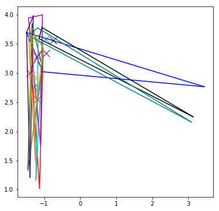
        
      
      
      
      
      
      
        - Focus output map
    
    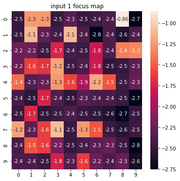
    
    
    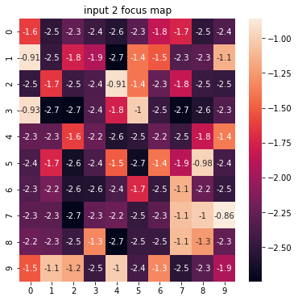

    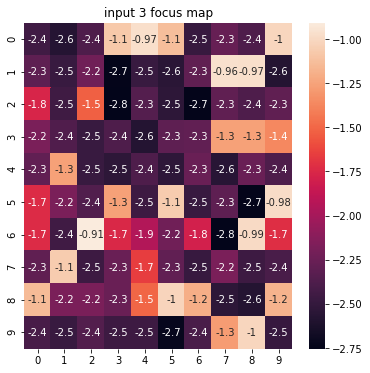
    
    
    
    
     - Classification output map    
     
     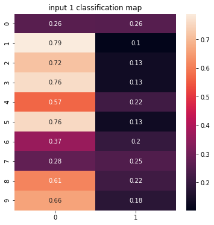  
      
      
 
     
     
     
   - At epoch fifty
  
  
  
  - Focus output map
    
    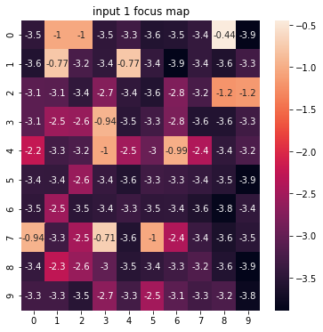
    
    
    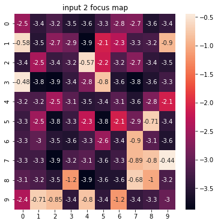

    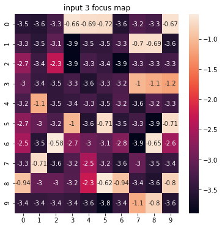
    
    
    
    
     - Classification output map    
     
     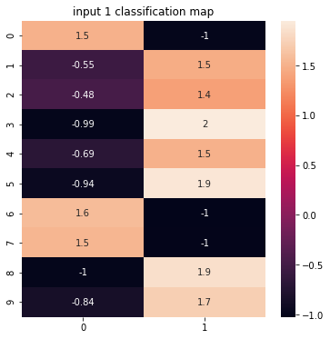   
     
     
     

   - At epoch hundred
    
      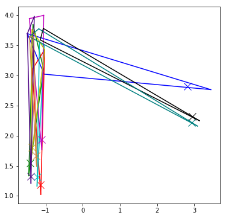 
      
      
      
      
      
      
      
      
   - Focus output map
    
    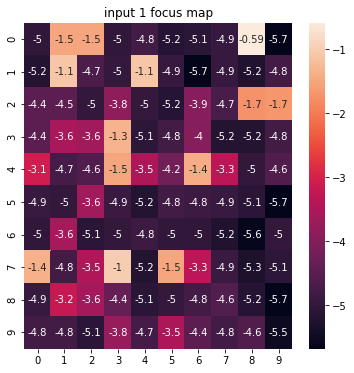
    
    
    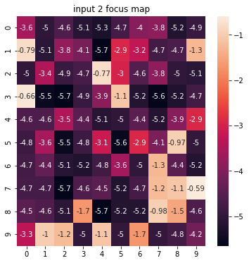

    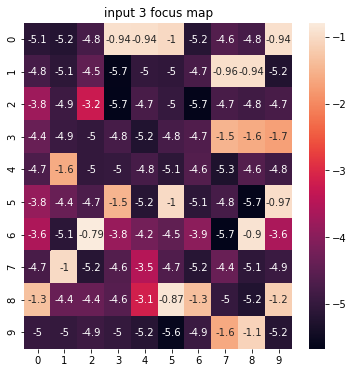
    
    
    
    
   - Classification output map    
     
     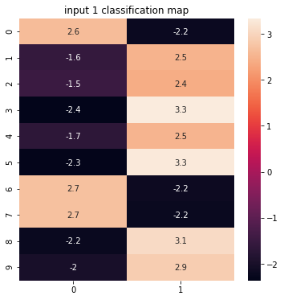   
     
   - Accuracy 100% , 2nd Case Accuracy is 100% at 5th epoch only
    
# Observations 
  - When mosaic data is not linearly separable 
     - The models needs attention to learn a good classifier.
     - For higher dimension once it learns some good attention weights, the attention weight learning stops.
  - When mosaic data is linearly separable
     - The model does not need attention to learn a good classifier.
     - For higher dimension model need not require to learn the attention weights, but is sometimes learning good attention weights.
