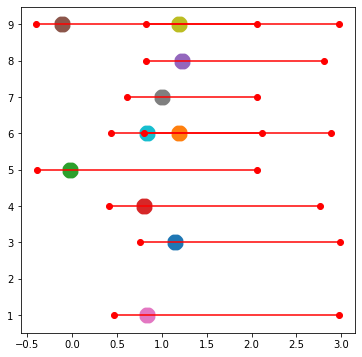

# Toy Data for visualizing mosaic data set with 

### Generation of 3 Classes Using 1 Dimentional data  
  data dimension,d = 1    
  classes, k = 2  
  num of foreground classes, nf = 2   
  num of background classes, bg = 1   
  - We sampled 150 (approx 50 for every class approx) 1-dim data points from uniform distribution as follows:
     - class 0 UNIF(-1,0) fg-class 1
     - class 1 UNIF(0,1) fg-class 2
     - class 2 UNIF(2,3) bg-class 1
  
   ###     data distribution
  
  
  ### generation of mosaic data
  - Available Classes = Class 0, Class 1, Class 2
  - Foregroud classes = Class 0, Class 1
  - Backgroud class =  Class 2
  - Every class will have a 1-dimensional Data Point. 1 data point was chosen at random from any foreground class, and other data point is  background class.
  - We have two one dimensional data point as one mosaic data with label as whichever foreground class is chosen.
  
### Models
model for what network - linear model (no hidden layer)  
model for where network - linear model (no hidden layer)   

### Input to Model
- Mosaic image is input to Module 1 i.e "Where Network", and tries to focus on foreground data present in Mosaic image.
- In Particular, Each image point (1 x 1) is input to "Where Network" and hence a 2 x 1 tensor (2 images) is input to "Where Network".
- "Where Network" tries to Focus on Foreground image and returns weighted average of 2 images.
- This average image is now input to "What Network" which finally predicts the Class label of foreground Image.

### Weights (containing focus_vs_pred values every 4 epoch) of above experiments can be found at following Gdrive link :
> https://drive.google.com/open?id=1LVs6MHsJp801i9-mSx-dzNgMSTVHR1F5

### Plots for Experiments are given below:
At epoch 0 

### Results 

