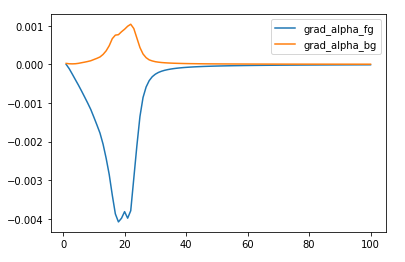

### Generationtion of 10 Classes Using 2 Dimentional data 
  - We sampled 1000 (100 for every class approx) 2-dim data points from multivariate Normal with 10 different Mean vectors and same Covariance Matrix.
  - Covariance Matrix being the diagonal matrix with enteries [0.01, 0.01].

### Generation of Mosaic Data
- Available Classes = Class 0, Class 1, Class 2, Class 3, Class 4, Class 5, Class 6, Class 7, Class 8
- foreground_classes = Class 0, Class 1, Class 2
- background_classes = Class3, Class 4, Class 5, Class 6, Class 7, Class 8, Class 9
- Every class will have a 2-dim Data Point. 1 data point was chosen at random from any foreground class, and rest 8 data points are chosen from background classes
-  Now we have 9 datapoints which can be arranged randomly in 3 x 3 matrix. In particular Dimention of Matrix will be 3 x 6.
- Following is one of the mosaic image for the sake of visualisation:


### MODEL
  - Model is developed as combination of 2 modules.
  - Module 1 learns "WHERE" the foreground image is present out of 9 images in Mosaic image.
  - Module 2 learns "WHAT" is the class of this foreground image out of those 3 foreground classes.

### Input to Model
- Mosaic image is input to Module 1 i.e "Where Network", and tries to focus on foreground image present in Mosaic Image.
- In Particular, Each image (2 x 1) is input to "Where Network" and hence a 18 x 1 tensor (9 images) is input to "Where Network".
- "Where Network" tries to Focus on Foreground image and returns weighted average of all 9 images.
- This image is now input to "What Network" which finally predicts the Class label of foreground Image.

### Architecture of the Model
```python
class Wherenet(nn.Module):
    def __init__(self):
        super(Wherenet,self).__init__()
        self.linear1 = nn.Linear(2,4)
        self.linear2 = nn.Linear(4,8)
        self.linear3 = nn.Linear(8,1)
    def forward(self,z):
        x = torch.zeros([batch,9],dtype=torch.float64)
        y = torch.zeros([batch,2], dtype=torch.float64)
        for i in range(9):
            x[:,i] = self.helper(z[:,2*i:2*i+2])[:,0]
        x = F.softmax(x,dim=1)   # alphas
        x1 = x[:,0]
        for i in range(9):
            x1 = x[:,i]          
            y = y+torch.mul(x1[:,None],z[:,2*i:2*i+2])
        return y , x 

    def helper(self,x):
        x = F.relu(self.linear1(x))
        x = F.relu(self.linear2(x))
        x = self.linear3(x)
        return x


class Whatnet(nn.Module):
    def __init__(self):
        super(Whatnet,self).__init__()
        self.linear1 = nn.Linear(2,4)
        self.linear2 = nn.Linear(4,3)
    def forward(self,x):
        x = F.relu(self.linear1(x))
        x = self.linear2(x)
        return x
where = Wherenet().double()
what = Whatnet().double()
```

### Gradient Definition
>grad_alpha_fg = Sum_over_data_points( (gradient(Loss) w.r.t alphas)(Fg_one_hot) )/ size_of_training_data
>grad_alpha_bg = Sum_over_data_points( (gradient(Loss) w.r.t alphas)(Bg_one_hot) )/ size_of_training_data


### Gradient(Loss) w.r.t alphas for Foreground and Background Classes


### Training Loss


