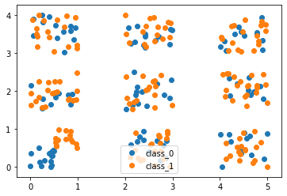
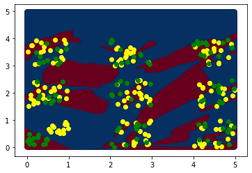
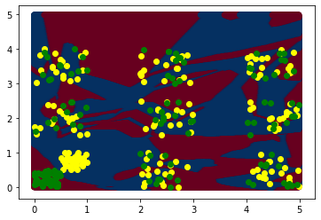

# Confounded Noise
  - a cluster of Linearly separable Data at corner with noise 
  - a cluster of Linearly separable Data at center with noise
  - a non-linealry separable data with noise
## Linearly separable at Corner with noise 
- Original Data

    
    
- Data with noise

    
    
- TABLE 2 : Analysis with size of true data

|true data  | Corrupted Data | Total Data | Training Accuracy | Test Accuracy |  Data Acc with no noise | 
|-----------| ---------------| ---------- | ----------------- |---------------| ----------------------- |
| 30        | 240            | 270        |   97              |   57          |  100                    |
| 60        | 240            | 300        |   96              |   61          |  100                    | 
| 90        | 240            | 330        |   96              |   66          |  100                    | 
| 120       | 240            | 360        |   98              |   67          |  100                    | 

-True Data size: 30

-True Data size: 60

-True Data size: 90

-True Data size: 120

 

