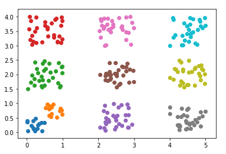

### Training DATA
Take 2 Dim data and create training data x_i, y_i as follows.



### Training data after Corruption

z_i = y_i if y_i is either 0 or 1 z_i is randomly 0 or 1 otherwise.
Train a network on this x_i, z_i data and predict labels on all test images. Check the accuracy on just the zero and one labelled test images.


### Test Data 


### Architecture for Models

```python
class Net(nn.Module):
    def __init__(self):
        super(Net,self).__init__()
        
        self.linear1 = nn.Linear(2,24)
        self.linear2 = nn.Linear(24,64)
        self.linear3 = nn.Linear(64,128)
        self.linear4 = nn.Linear(128,256)
        self.linear5 = nn.Linear(256,128)
        self.linear6 = nn.Linear(128,64)
        self.linear7 = nn.Linear(64,32)
        self.linear8 = nn.Linear(32,16)
        self.linear9 = nn.Linear(16,2)
        
    def forward(self,x):
        x = F.relu(self.linear1(x))
        x = F.relu(self.linear2(x))
        x = F.relu(self.linear3(x))
        x = F.relu(self.linear4(x))
        x = F.relu(self.linear5(x))
        x = F.relu(self.linear6(x))
        x = F.relu(self.linear7(x))
        x = F.relu(self.linear8(x))
        x = self.linear9(x)
        return x
```

### After training, Classification of Train DATA 

> Accuracy on Training data: 97%

### After training, Classification of Test DATA 

> Accuracy on Test data: 57%


##### Weights Link : 
> Model with 97% accuracy : https://drive.google.com/open?id=1-VCQCBKprN7_F717L_Dgxu002Kdoks-j

> Model with 90% accuracy : https://drive.google.com/open?id=1-Uguu8H0SaOVt5-wS8SL50vUQUgVAc6j


