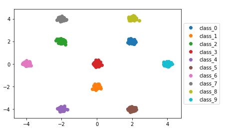
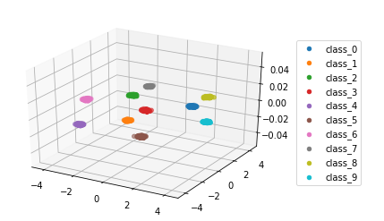
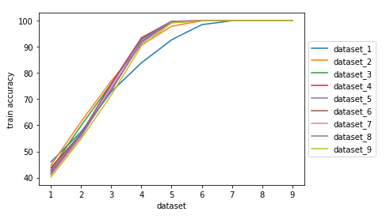
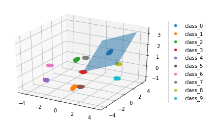
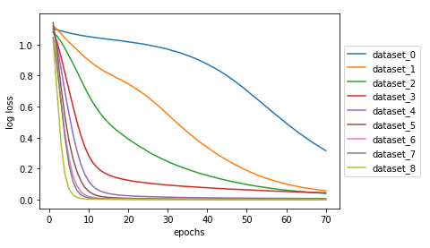
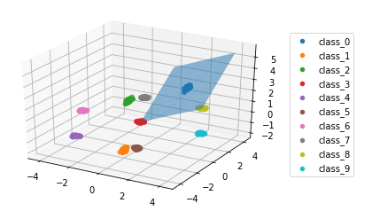
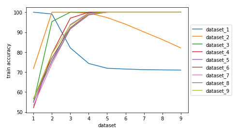
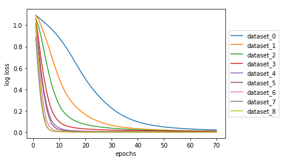
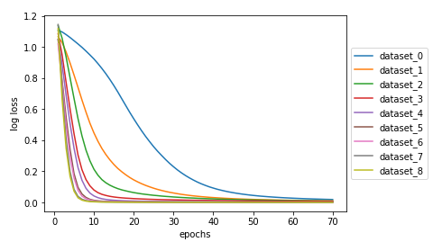

### DATA Generation
Data is generated s.t class 0,1,2 are in one plane (P_fg), and Class 3,4,5,6,7,8,9 are in other plane (P_bg).

### DATA segregation
Class 0,1,2 are Foreground class

Class 3,4,5,6,7,8,9 are back ground class

### Data Visualisation
When Both plane P_fg and P_bg are coincident, then they may be visualise in plane as :

And in 3D as :

A small plane denote the plane of FG classes:

#### P_bg is fixed as x-y plane

## Lets vary the angle between P_fg and P_bg and observe the results:

#### 1. Angle<P_fg, P_bg> = 0

A small plane denote the plane of FG classes:

Training on Datasets can be visualise by:

Loss on Datasets can be visualise by:

#### 2. Angle<P_fg, P_bg> = 30

A small plane denote the plane of FG classes:

Training on Datasets can be visualise by:

Loss on Datasets can be visualise by:

#### 3. Angle<P_fg, P_bg> = 45

A small plane denote the plane of FG classes:

Training on Datasets can be visualise by:

Loss on Datasets can be visualise by:

#### 4. Angle<P_fg, P_bg> = 60

A small plane denote the plane of FG classes:

Training on Datasets can be visualise by:

Loss on Datasets can be visualise by:

#### 5. Angle<P_fg, P_bg> = -45

A small plane denote the plane of FG classes:

Training on Datasets can be visualise by:

Loss on Datasets can be visualise by:

#### 6. Angle<P_fg, P_bg> = -60

A small plane denote the plane of FG classes:

Training on Datasets can be visualise by:

Loss on Datasets can be visualise by:

